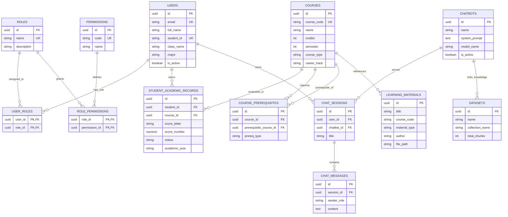
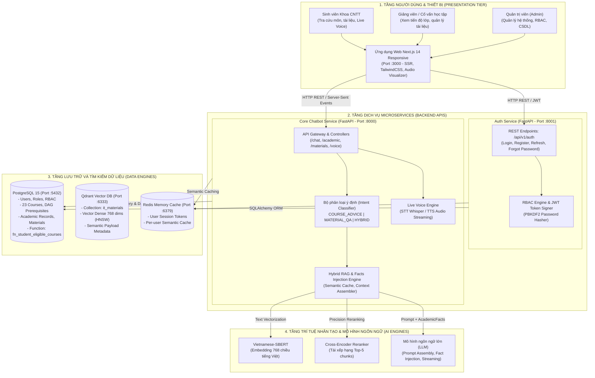
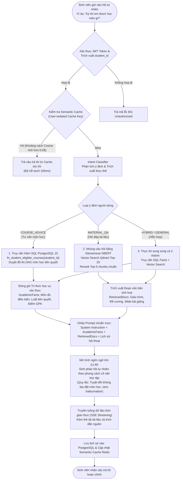
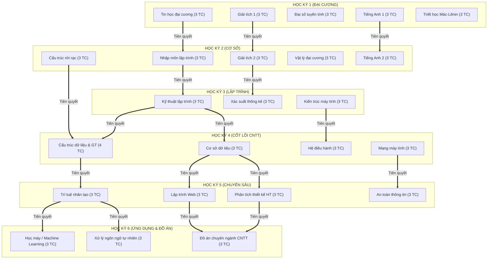
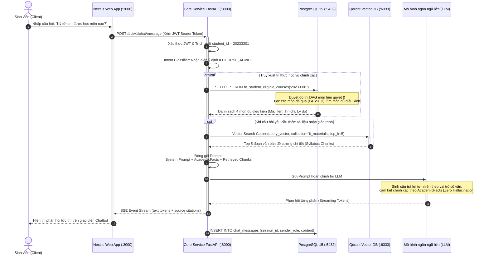

# TÀI LIỆU HỆ THỐNG SƠ ĐỒ KỸ THUẬT (MERMAID DIAGRAMS)

Hệ thống: **Cố vấn Học tập Khoa CNTT (IT Student Chatbot Advisor)**

## Sơ đồ thực thể liên kết (ERD) Cơ sở dữ liệu PostgreSQL 15

---

## Sơ đồ khối kiến trúc hệ thống Microservices

---

## Sơ đồ luồng xử lý Hybrid RAG và Tiêm tri thức học vụ

---

## Sơ đồ Đồ thị có hướng không chu trình (DAG) tiên quyết môn học

---

## Sơ đồ ca sử dụng hệ thống (Use Case Diagram)

```mermaid
flowchart TB
    subgraph ACTORS["CÁC TÁC NHÂN HỆ THỐNG (ACTORS)"]
        direction LR
        SV["🎓 Sinh viên (Student)"]
        GV["👨‍🏫 Giảng viên / Cố vấn (Teacher)"]
        AD["⚙️ Quản trị viên (Admin)"]
    end

    subgraph SYSTEM["HỆ THỐNG CỐ VẤN HỌC TẬP KHOA CNTT (AIRC CHATBOT)"]
        direction TB

        subgraph ROW1["PHÂN HỆ TRUY CẬP VÀ NGHIỆP VỤ SINH VIÊN"]
            direction LR
            subgraph G1["1. Xác thực & Hồ sơ"]
                direction TB
                UC1(["Đăng nhập / Đăng ký"])
                UC2(["Quên & Đặt lại mật khẩu"])
                UC3(["Xem & Cập nhật hồ sơ"])
            end
            subgraph G2["2. Trợ lý Cố vấn Học vụ Sinh viên"]
                direction TB
                UC4(["Hỏi đáp quy chế & Lộ trình đào tạo"])
                UC5(["Tra cứu môn học đủ điều kiện"])
                UC6(["Tra cứu điểm & Môn cần học lại"])
                UC7(["Tìm kiếm & Tải tài liệu PDF"])
                UC8(["Tương tác giọng nói Live Voice"])
            end
        end

        subgraph ROW2["PHÂN HỆ GIẢNG VIÊN VÀ QUẢN TRỊ VIÊN"]
            direction LR
            subgraph G3["3. Nghiệp vụ Giảng viên / Cố vấn"]
                direction TB
                UC9(["Xem tiến độ học tập sinh viên"])
                UC10(["Xem trực quan sơ đồ DAG tiên quyết"])
                UC11(["Quản lý & Đóng góp tài liệu"])
                UC12(["Hỏi đáp trợ lý chuyên môn AI"])
            end
            subgraph G4["4. Nghiệp vụ Quản trị Hệ thống (Admin)"]
                direction TB
                UC13(["Quản trị người dùng & Phân quyền RBAC"])
                UC14(["Quản lý 23 môn học & Cây tiên quyết"])
                UC15(["Nhập liệu & Cập nhật bảng điểm"])
                UC16(["Quản trị kho tri thức Vector Qdrant"])
                UC17(["Cấu hình tham số RAG Pipeline & LLM"])
            end
        end
    end

    ACTORS ~~~ SYSTEM
    ROW1 ~~~ ROW2

    %% Liên kết Sinh viên
    SV --> UC1
    SV --> UC2
    SV --> UC3
    SV --> UC4
    SV --> UC5
    SV --> UC6
    SV --> UC7
    SV --> UC8

    %% Liên kết Giảng viên
    GV --> UC1
    GV --> UC3
    GV --> UC9
    GV --> UC10
    GV --> UC11
    GV --> UC12

    %% Liên kết Quản trị viên
    AD --> UC1
    AD --> UC3
    AD --> UC13
    AD --> UC14
    AD --> UC15
    AD --> UC16
    AD --> UC17
```

---

## Sơ đồ tuần tự tương tác thời gian thực (Sequence Diagram)

---

