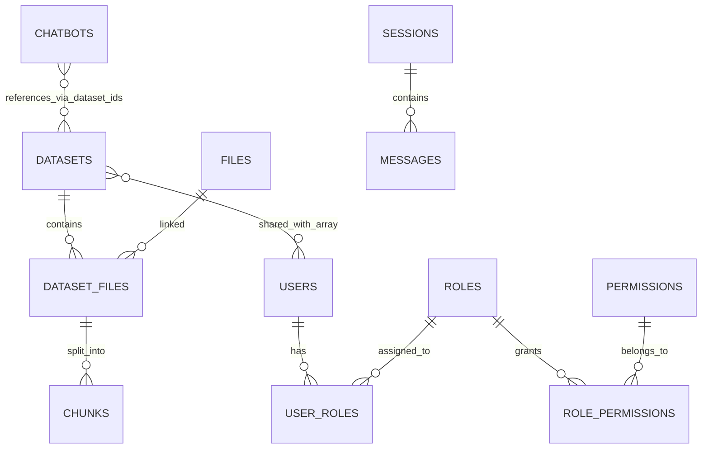
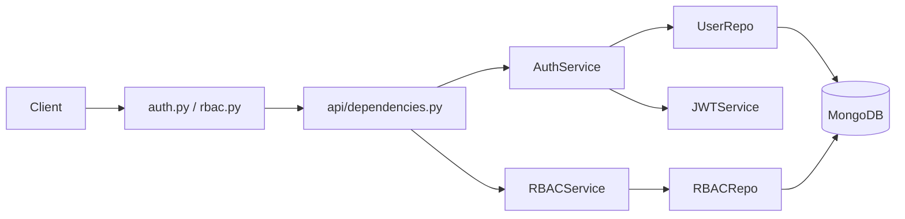

# CODEBASE_CONTEXT

Last updated: 2026-05-28

This document is a high-density operational context for AI agents. It is designed so future agents can answer implementation, architecture, and API questions without re-reading the full codebase.

## 1. Project Overview

### 1.1 Purpose and business domain
- Internal enterprise chatbot platform using RAG (Retrieval-Augmented Generation) for organizational knowledge lookup.
- Three core concerns are separated:
  - Identity, authentication, RBAC administration.
  - RAG ingestion/retrieval/generation workflows.
  - Web UI for admin + employee + intern/guest usage.

### 1.2 Architecture style
- Monorepo with service boundaries.
- Microservice runtime:
  - `airc_internal_chatbot_auth` (Auth + RBAC API).
  - `airc_internal_chatbot_core` (RAG API + background worker).
  - `airc_internal_chatbot_ui` (Next.js frontend).
- Layering pattern in backend services:
  - API routers -> dependency injection -> service layer -> repository layer -> MongoDB/Qdrant/Redis.

### 1.3 Technology stack (from source/config)

| Area | Stack | Versions / notes |
|---|---|---|
| Auth service | Python + FastAPI + Motor + PyJWT + Passlib | Docker base `python:3.11-slim`; `fastapi>=0.109`, `uvicorn>=0.27` |
| Core service | Python + FastAPI + Motor + Redis/RQ + Qdrant + Gemini | Docker base `python:3.10-slim`; `fastapi>=0.115`, `sentence-transformers>=2.6` |
| UI service | Next.js + React + TypeScript + AntD + Zustand + Axios | `next=16.1.2`, `react=19.2.3`, `antd^6.2.0`, `typescript^5` |
| Datastores | MongoDB, Redis, Qdrant | Compose: Mongo 6.0, Redis 7-alpine, Qdrant latest |
| Deployment | Docker Compose + Kubernetes manifests | Service-level k8s folders + shared infra in `k8s-infrastructure` |

## 2. Directory Structure (annotated, 2-3 levels)

```text
.
|- README.md                        # Root operational/deploy overview
|- docker-compose.local.yml         # Local runtime orchestration (Auth/Core/Worker/UI + Mongo/Redis/Qdrant)
|- airc_internal_chatbot_auth/
|  |- app/
|  |  |- main.py                    # FastAPI app, middleware stack, router mounting
|  |  |- api/
|  |  |  |- dependencies.py         # Auth/RBAC DI and security dependencies
|  |  |  |- v1/auth.py              # Auth/user endpoints
|  |  |  |- v1/rbac.py              # RBAC CRUD/assignment endpoints
|  |  |- core/                      # settings, mongo connection, rate limiter, security middleware
|  |  |- models/                    # user + RBAC pydantic schemas
|  |  |- repositories/              # user/rbac data access
|  |  |- services/                  # auth, jwt, rbac business logic
|  |- migrate/                      # DB seed scripts
|  |- k8s/                          # Auth deployment/service/configmap
|- airc_internal_chatbot_core/
|  |- app/
|  |  |- main.py                    # FastAPI app, model warmup, router mounting
|  |  |- api/
|  |  |  |- dependencies.py         # token verification bridge to Auth, DI wiring
|  |  |  |- v1/                     # chat, datasets, files, sessions, chatbots, stats endpoints
|  |  |- core/                      # config, mongo connection, Redis queue setup
|  |  |- models/                    # auth/schema/chatbot/enums
|  |  |- repositories/              # datasets/files/chunks/sessions/chatbots data access
|  |  |- services/                  # RAG pipeline + dataset/chatbot processing logic
|  |  |- jobs/ingest.py             # RQ job entrypoint
|  |- worker.py                     # RQ worker process entrypoint
|  |- migrate/                      # core seeds
|  |- k8s/                          # Core + worker deployment manifests
|- airc_internal_chatbot_ui/
|  |- src/
|  |  |- app/                       # Next App Router pages (auth/dashboard/admin)
|  |  |- components/                # UI components (Admin/Auth/Chat/Dataset/etc.)
|  |  |- core/                      # domain entities + repository interfaces
|  |  |- infrastructure/            # axios clients, interceptors, repository adapters
|  |  |- services/                  # API service facades
|  |  |- stores/                    # Zustand stores for auth/chat/dataset state
|  |  |- middleware.ts              # route guard middleware using auth cookie
|  |- next.config.ts                # standalone build + TS build behavior
|  |- k8s/                          # UI deployment/service
|- k8s-infrastructure/              # shared namespace/config/infra/ingress/cloudflared
|- document/                        # architecture and API docs (VN)
```

## 3. Entry Points and Runtime

### 3.1 Backend entrypoints
- Auth API entrypoint: `airc_internal_chatbot_auth/app/main.py`
  - mounts `/api/auth` and `/api/rbac`
  - adds security middlewares + rate limiting.
- Core API entrypoint: `airc_internal_chatbot_core/app/main.py`
  - mounts `/api/v1/{chat,datasets,files,sessions,chatbots,stats}`
  - preloads embedding/rerank models and configures LLM service.
- Worker entrypoint: `airc_internal_chatbot_core/worker.py`
  - starts RQ worker on queue `ingest`.
- Job function: `airc_internal_chatbot_core/app/jobs/ingest.py`
  - resolves repos/services and runs `ProcessingService.process_dataset_file(...)`.

### 3.2 Frontend entrypoint
- Next.js app router root: `airc_internal_chatbot_ui/src/app`.
- Route middleware: `airc_internal_chatbot_ui/src/middleware.ts`.
  - Protects `/dashboard/*` using cookie `access_token`.

### 3.3 Local runtime composition
- `docker-compose.local.yml` starts:
  - `auth_service:8001`, `core_service:8000`, `worker_service`, `ui_service:3000`, `mongodb:27017`, `redis:6379`, `qdrant:6333`.

## 4. Core Modules / Components

Below are major modules with responsibility, signatures, and dependency direction.

### 4.1 AuthService
- Path: `airc_internal_chatbot_auth/app/services/auth_service.py`
- Responsibility:
  - registration/login, password hashing/verification, JWT issuance, user admin CRUD helper methods.
  - resolves canonical role from `user_roles` mapping.
- Key signatures:

```python
class AuthService:
    def __init__(self, user_repo: UserRepository)
    @staticmethod
    def hash_password(password: str) -> str
    @staticmethod
    def verify_password(plain_password: str, hashed_password: str) -> bool
    async def register(self, user_data: UserCreate) -> Token
    async def login(self, email: str, password: str) -> Token
    async def get_user_by_id(self, user_id: str) -> Optional[UserInDB]
    def verify_token(self, token: str)
    async def get_all_users(self, role_code: Optional[str] = None) -> list[UserInDB]
```

- Depends on:
  - `UserRepository`, `JWTService`, `passlib`.
- Imported by:
  - `app/api/dependencies.py`, `app/api/v1/auth.py`.

### 4.2 JWTService
- Path: `airc_internal_chatbot_auth/app/services/jwt_service.py`
- Responsibility:
  - create/verify JWT with standard claims (`sub`, `iat`, `exp`, `jti`) + custom `email`, `role`.
- Key signatures:

```python
class JWTService:
    @staticmethod
    def create_access_token(user_id: str, email: str, role: str) -> str
    @staticmethod
    def create_refresh_token(user_id: str) -> str
    @staticmethod
    def verify_token(token: str) -> Optional[TokenData]
```

- Depends on:
  - `pyjwt`, `app.core.settings`.
- Imported by:
  - `AuthService`.

### 4.3 RBACService
- Path: `airc_internal_chatbot_auth/app/services/rbac_service.py`
- Responsibility:
  - permission resolution via DB roles/permissions, wildcard checks, in-memory permission cache.
- Key signatures:

```python
class RBACService:
    async def can_manage_system(self, user_id: str) -> bool
    async def check_permission(self, user_id: str, permission_code: str, resource_owner_id: Optional[str] = None) -> bool
    async def get_user_permissions(self, user_id: str) -> List[PermissionResponse]
    async def get_permission_matrix(self) -> dict
```

- Depends on:
  - `RBACRepository`.
- Imported by:
  - `app/api/dependencies.py`, `app/api/v1/auth.py`, `app/api/v1/rbac.py`.

### 4.4 ChatService (RAG orchestrator)
- Path: `airc_internal_chatbot_core/app/services/chat_service.py`
- Responsibility:
  - complete RAG request lifecycle: embed -> cache -> retrieval -> rerank -> prompt -> generate -> session persistence.
  - enforces chatbot role gating and dataset context locking.
- Key signatures:

```python
class ChatService:
    async def ask_question(
        self,
        question: str,
        dataset_ids: List[str],
        history: Optional[List[Dict]] = None,
        session_id: Optional[str] = None,
        chatbot_id: Optional[str] = None,
        user_context: Optional[Dict] = None,
    ) -> Dict[str, Any]
```

- Depends on:
  - repositories (`dataset`, `dataset_file`, `chunk`, optional `session`, `chatbot`)
  - services (`embedding_service`, `vector_service`, `rerank_service`, `prompt_service`, `llm_service`, `semantic_cache_service`).
- Imported by:
  - DI in `app/api/dependencies.py`, used by `app/api/v1/chat.py`.

### 4.5 DatasetService
- Path: `airc_internal_chatbot_core/app/services/dataset_service.py`
- Responsibility:
  - dataset lifecycle, dataset-file joins, sharing, cleanup (including vector index delete), chunk listing.
- Key signatures:

```python
class DatasetService:
    async def create_dataset(self, name: str, owner_id: str, visibility: str = "private", chatbot_ids: Optional[List[str]] = None) -> dict
    async def share_dataset(self, dataset_id: str, user_ids: List[str]) -> bool
    async def add_files_to_dataset(self, dataset_id: str, file_ids: List[str]) -> Dict[str, List]
    async def delete_dataset(self, dataset_id: str) -> bool
    async def toggle_dataset_file(self, dataset_file_id: str, is_enabled: bool) -> bool
```

- Depends on:
  - `DatasetRepository`, `DatasetFileRepository`, `FileRepository`, `ChunkRepository`, `vector_service`.
- Imported by:
  - DI in `app/api/dependencies.py`, routers in `app/api/v1/datasets.py`.

### 4.6 ProcessingService (ingest worker logic)
- Path: `airc_internal_chatbot_core/app/services/processing_service.py`
- Responsibility:
  - background file processing: read file -> extract text -> chunk -> embed -> save chunks -> upsert vectors -> status transitions.
- Key signatures:

```python
class ProcessingService:
    async def process_dataset_file(self, dataset_id: str, dataset_file_id: str)
```

- Depends on:
  - dataset file/file/chunk repositories, `chunking_service`, `embedding_service`, `vector_service`, `pypdf`, `python-docx`.
- Imported by:
  - `app/jobs/ingest.py`, DI for dataset router background operations.

### 4.7 ChatbotService
- Path: `airc_internal_chatbot_core/app/services/chatbot_service.py`
- Responsibility:
  - chatbot CRUD, RBAC visibility filtering, dataset assignment, admin-only create gate.
- Key signatures:

```python
class ChatbotService:
    async def create_chatbot(self, creator_id: str, creator_role: str, data: ChatbotCreate) -> dict
    async def get_available_chatbots(self, user_id: str, user_role: str) -> List[dict]
    async def update_chatbot(self, chatbot_id: str, user_id: str, user_role: str, data: ChatbotUpdate) -> Optional[dict]
```

- Depends on:
  - `ChatbotRepository`, `DatasetRepository`.
- Imported by:
  - DI and `app/api/v1/chatbots.py`.

### 4.8 SessionRepository
- Path: `airc_internal_chatbot_core/app/repositories/session_repository.py`
- Responsibility:
  - persistent session/message storage and ownership-bound retrieval.
- Key signatures:

```python
class SessionRepository(BaseRepository):
    async def create_session(self, user_id: str, name: str) -> dict
    async def get_user_sessions(self, user_id: str, limit: int = 50, skip: int = 0) -> List[dict]
    async def add_message(self, session_id: str, role: str, content: str) -> dict
    async def get_messages(self, session_id: str, limit: int = 100) -> List[dict]
```

- Depends on:
  - Mongo collections `sessions`, `messages`.
- Imported by:
  - `app/api/v1/sessions.py`, `ChatService` (through DI).

### 4.9 Frontend auth and chat state modules

#### Auth store
- Path: `airc_internal_chatbot_ui/src/stores/authStore.ts`
- Responsibility:
  - token/user/permission state, login/logout/checkAuth orchestration, persistence.
- Key signatures:

```ts
interface AuthState {
  login(email: string, password: string): Promise<void>
  logout(): void
  checkAuth(): Promise<void>
}
```

- Depends on:
  - `authService`, `storageService`, `chatStore`.
- Imported by:
  - route guards/components and HTTP interceptor token helper.

#### Chat store
- Path: `airc_internal_chatbot_ui/src/stores/chatStore.ts`
- Responsibility:
  - session list, active conversation state, message send flow, chatbot/dataset selection, debug metrics state.
- Key signatures:

```ts
interface ChatState {
  loadSessions(): Promise<void>
  createSession(name?: string): Promise<string>
  sendMessage(question: string): Promise<void>
  selectChatbot(id: string | null, datasetIds?: string[]): void
  resetStore(): void
}
```

- Depends on:
  - `chatService`.
- Imported by:
  - dashboard chat components and `authStore` reset flow.

## 5. Data Models and Schemas

### 5.1 Auth-side entities

| Entity | Source | Fields (type) |
|---|---|---|
| User (`users`) | `app/repositories/user_repository.py` + `models/user.py` | `email:str`, `hashed_password:str`, `full_name:str`, `role:str`, `is_active:bool`, `created_at:datetime`, `updated_at?:datetime` |
| Role (`roles`) | `models/rbac.py` + `rbac_repository.py` | `name:str`, `code:str`, `description?:str`, `is_system:bool`, `is_active:bool`, `created_at`, `updated_at?`, `created_by?:ObjectId` |
| Permission (`permissions`) | `models/rbac.py` + `rbac_repository.py` | `name:str`, `code:str`, `resource:str`, `action:str`, `scope?:str`, `description?:str`, `is_system:bool`, `created_at`, `updated_at?`, `created_by?:ObjectId` |
| UserRole (`user_roles`) | `rbac_repository.py` | `user_id:ObjectId`, `role_id:ObjectId`, `assigned_at:datetime`, `assigned_by?:ObjectId`, `expires_at?:datetime` |
| RolePermission (`role_permissions`) | `rbac_repository.py` | `role_id:ObjectId`, `permission_id:ObjectId`, `granted_at:datetime`, `granted_by?:ObjectId` |

### 5.2 Core-side entities

| Entity | Source | Fields (type) |
|---|---|---|
| Dataset (`datasets`) | `dataset_repository.py` | `name:str`, `owner_id:str`, `visibility:str`, `shared_with:list[str]`, `created_at:datetime` |
| File (`files`) | `file_repository.py` | `name:str`, `size:int`, `mime_type:str`, `path:str`, `status:str`, `uploaded_at:datetime`, `processed_at?:datetime`, `error?:str` |
| DatasetFile (`dataset_files`) | `dataset_file_repository.py` | `dataset_id:str`, `file_id:str`, `status:str`, `chunk_count:int`, `is_enabled:bool`, `created_at:datetime`, `processed_at?:datetime` |
| Chunk (`chunks`) | `chunk_repository.py` | `dataset_id:str`, `dataset_file_id:str`, `file_id:str`, `chunk_index:int`, `text:str`, `vector_id?:int` |
| Chatbot (`chatbots`) | `chatbot_repository.py` + `chatbot_schemas.py` | `name:str`, `description?:str`, `icon?:str`, `config:dict`, `dataset_ids:list[str]`, `allowed_roles:list[str]`, `visibility:str`, `owner_id:str`, `is_active:bool`, `created_at`, `updated_at?` |
| Session (`sessions`) | `session_repository.py` | `user_id:str`, `name:str`, `created_at`, `updated_at` |
| Message (`messages`) | `session_repository.py` | `session_id:str`, `role:str`, `content:str`, `created_at` |

### 5.3 Vector store payload model
- Qdrant collection naming: `dataset_<dataset_id>`.
- Payload used in vector points:
  - `chunk_id`, `dataset_file_id`, `dataset_id`.

### 5.4 Key DTO schemas

| DTO | Source | Key fields |
|---|---|---|
| `ChatRequest` | `core/app/models/schemas.py` | `question`, `dataset_ids[]`, `session_id?`, `chatbot_id?`, `history?` |
| `ChatResponse` | same | `status`, `question`, `answer`, `sources[]`, `errors[]`, `debug?` |
| `ShareDatasetRequest` | same | `user_ids?`, `student_ids?` (legacy), `all_students` (legacy mode) |
| `ChatbotConfigModel` | `core/app/models/chatbot_schemas.py` | retrieval/reranker/LLM/prompt/no-context behavior config |
| `UserCreate`, `UserResponse`, `Token` | `auth/app/models/user.py` | auth user + token contracts |
| `Role*`, `Permission*` | `auth/app/models/rbac.py` | RBAC CRUD and assignment contracts |

### 5.5 Relationships



## 6. API / Interface Contracts

All backend APIs are REST over JSON unless noted.

### 6.1 Auth API (`/api/auth`)

| Method | Path | Input | Output | Side effects |
|---|---|---|---|---|
| POST | `/register` | `UserCreate` | `Token` | creates user row, hashes password |
| POST | `/login` | `LoginRequest` | `Token` | tracks failed login rate-limit counters |
| POST | `/verify` | `{ token: string }` | `{ id, email, full_name, role }` | none (read/verify) |
| POST | `/forgot-password` | placeholder payload | `{message}` | currently stub/no email flow |
| GET | `/me` | bearer token | `UserResponse` | none |
| GET | `/me/permissions` | bearer token | `string[]` | none |
| GET | `/users?role=` | bearer token | `UserResponse[]` | none; employee can only query `intern_guest` |
| POST | `/users` | `UserCreate` | `UserResponse` | admin user creation |
| PATCH | `/users/{user_id}` | `UserUpdate` | `UserResponse` | updates user + optional password hash |
| DELETE | `/users/{user_id}` | path param | `204` | deletes user |

### 6.2 RBAC API (`/api/rbac`)

| Method | Path | Input | Output | Side effects |
|---|---|---|---|---|
| GET | `/permissions` | `include_system?` | `PermissionResponse[]` | none |
| POST | `/permissions` | `PermissionCreate` | `PermissionResponse` | inserts permission, auto-grants to admin role |
| GET | `/permissions/{permission_id}` | path param | `PermissionResponse` | none |
| PATCH | `/permissions/{permission_id}` | `PermissionUpdate` | `PermissionResponse` | updates permission metadata |
| DELETE | `/permissions/{permission_id}` | path param | `204` | deletes non-system permission + mappings |
| GET | `/roles` | `include_inactive?` | `RoleResponse[]` | public endpoint |
| GET | `/roles/{role_id}` | path param | `RoleWithPermissions` | none |
| POST | `/roles` | `RoleCreate` | `RoleResponse` | creates role |
| PATCH | `/roles/{role_id}` | `RoleUpdate` | `RoleResponse` | updates role |
| DELETE | `/roles/{role_id}` | path param | `204` | deletes role + role/user mappings |
| POST | `/roles/{role_id}/permissions` | `GrantPermissionsRequest` | `204` | replaces full role permission set |
| DELETE | `/roles/{role_id}/permissions/{permission_id}` | path params | `204` | removes one mapping |
| POST | `/users/{user_id}/roles` | `AssignRoleRequest` | `204` | assigns role to user |
| DELETE | `/users/{user_id}/roles/{role_id}` | path params | `204` | removes role from user |
| GET | `/users/{user_id}/roles` | path param | `RoleResponse[]` | none |
| GET | `/users/{user_id}/permissions` | path param | `string[]` | none |
| POST | `/users/{user_id}/check-permission` | `PermissionCheckRequest` | `PermissionCheckResponse` | none |
| GET | `/matrix` | none | `PermissionMatrixResponse` | none |

### 6.3 Core API (`/api/v1`)

#### Chat

| Method | Path | Input | Output | Side effects |
|---|---|---|---|---|
| POST | `/chat/ask` | `ChatRequest` | `ChatResponse` | may persist session messages, reads vector DB, calls Gemini, updates semantic cache |

#### Datasets

| Method | Path | Input | Output | Side effects |
|---|---|---|---|---|
| GET | `/datasets/ping` | none | health payload | none |
| POST | `/datasets` | `DatasetCreate` | `DatasetResponse` | inserts dataset; optional chatbot assignment |
| GET | `/datasets` | none | `DatasetResponse[]` | role-filtered listing |
| GET | `/datasets/{dataset_id}` | path param | `DatasetResponse` | none |
| PATCH | `/datasets/{dataset_id}` | dataset payload | `DatasetResponse` | updates dataset metadata |
| DELETE | `/datasets/{dataset_id}` | path param | `SuccessResponse` | deletes dataset + dataset_files + chunks + Qdrant collection |
| POST | `/datasets/{dataset_id}/files` | `AddFilesToDatasetRequest` | `{status,added,skipped}` | inserts dataset_file records + enqueues ingest jobs |
| GET | `/datasets/{dataset_id}/files` | path param | `DatasetFileResponse[]` | none |
| PATCH | `/datasets/{dataset_id}/files/{dataset_file_id}` | toggle payload | `SuccessResponse` | updates `is_enabled` |
| DELETE | `/datasets/{dataset_id}/files/{dataset_file_id}` | path params | `SuccessResponse` | deletes dataset-file relation + related chunks |
| GET | `/datasets/{dataset_id}/files/{dataset_file_id}/chunks` | path params | `ChunkResponse[]` | none |
| PUT | `/datasets/{dataset_id}/files/{dataset_file_id}/toggle` | toggle payload | `SuccessResponse` | updates `is_enabled` |
| POST | `/datasets/{dataset_id}/share` | `ShareDatasetRequest` | `SuccessResponse` | replaces `shared_with` list |

#### Files

| Method | Path | Input | Output | Side effects |
|---|---|---|---|---|
| POST | `/files/upload` | multipart file | `FileUploadResponse` | writes file to disk + inserts file metadata |
| GET | `/files/` | none | `FileResponse[]` | none |
| GET | `/files/{file_id}` | path param | `FileResponse` | none |
| GET | `/files/{file_id}/view` | path param | stream/attachment | reads file from disk |

#### Sessions

| Method | Path | Input | Output | Side effects |
|---|---|---|---|---|
| POST | `/sessions/` | `ChatSessionCreate` | `ChatSessionResponse` | creates session |
| GET | `/sessions/` | `limit,skip` | `ChatSessionResponse[]` | none |
| GET | `/sessions/{session_id}` | path param | `ChatSessionResponse` | none |
| PATCH | `/sessions/{session_id}` | `ChatSessionUpdate` | `ChatSessionResponse` | updates session |
| DELETE | `/sessions/{session_id}` | path param | message payload | deletes session + all session messages |
| GET | `/sessions/{session_id}/messages` | `limit` | `ChatMessageResponse[]` | none |
| POST | `/sessions/{session_id}/messages` | `ChatMessageCreate` | `ChatMessageResponse` | appends message |

#### Chatbots

| Method | Path | Input | Output | Side effects |
|---|---|---|---|---|
| POST | `/chatbots` | `ChatbotCreate` | `ChatbotResponse` | creates chatbot (admin only) |
| GET | `/chatbots` | none | `ChatbotResponse[]` | role-filtered visibility |
| GET | `/chatbots/{chatbot_id}` | path param | `ChatbotResponse` | permission checks |
| PATCH | `/chatbots/{chatbot_id}` | `ChatbotUpdate` | `ChatbotResponse` | updates chatbot |
| DELETE | `/chatbots/{chatbot_id}` | path param | `SuccessResponse` | deletes chatbot |
| POST | `/chatbots/{chatbot_id}/datasets` | `ChatbotAssignDatasetsRequest` | `ChatbotResponse` | replaces chatbot dataset links |

#### Stats

| Method | Path | Input | Output | Side effects |
|---|---|---|---|---|
| GET | `/stats/dashboard` | none | `DashboardStats` | reads aggregates; includes heuristic/default metrics |
| GET | `/stats/recent-activity` | `limit?` | `RecentActivity[]` | reads recent records |

### 6.4 Frontend public service interfaces (TypeScript)

| Module | Public contract |
|---|---|
| `src/services/authService.ts` | `login`, `getMe`, `getPermissions`, `getAllUsers`, admin user CRUD |
| `src/services/rbacService.ts` | permission CRUD, role CRUD, assign permissions, assign/remove/get user roles, matrix |
| `src/services/datasetService.ts` | dataset CRUD, dataset file ops, share, chunk retrieval |
| `src/services/chatService.ts` | session CRUD, message retrieval, `askQuestion` |
| `src/services/chatbotService.ts` | chatbot CRUD, assign datasets, access config by allowed_user_ids/allowed_departments |
| `src/stores/authStore.ts` | `login/logout/checkAuth`, token + user + permissions state |
| `src/stores/chatStore.ts` | chat sessions/messages flow with chatbot/dataset context |

## 7. Business Logic and Rules

### 7.1 Auth and RBAC rules
- JWT verification and user active check are mandatory in protected routes.
- Role source-of-truth is `user_roles` + `roles` collections, not only `users.role`.
- RBAC admin invariants:
  - cannot create another `admin` role via API.
  - cannot delete admin role.
  - newly created permissions are auto-granted to admin role.
- User list restrictions in auth `/users`:
  - `admin`: any role filter.
  - `employee`: must pass `role=intern_guest` only.

### 7.2 Dataset and sharing rules
- Only `admin`/`employee` can create/upload/manage datasets/files.
- `employee` ownership checks enforced on many dataset mutating endpoints.
- `share_dataset` replaces `shared_with` with normalized deduplicated list.

### 7.3 Chatbot access and context isolation
- Chatbot create is `admin` only.
- For non-admin users, chatbot usage requires role in `allowed_roles`.
- Critical security behavior in chat pipeline:
  - If `chatbot_id` exists and has `dataset_ids`, user-supplied `dataset_ids` are overridden (context locking).
  - Additional dataset accessibility filtering for non-admin users: only owner/shared datasets remain.

### 7.4 RAG request algorithm (`ChatService.ask_question`)
1. Validate input and optionally persist user message to session.
2. Embed question.
3. Attempt semantic cache hit (cache key optionally namespaced by chatbot).
4. Resolve chatbot config (`top_k`, reranker, model, prompt, no-context behavior).
5. Retrieve chunks per dataset:
   - vector search in Qdrant (filtered to enabled files),
   - regex fallback search in chunks collection.
6. Optional rerank.
7. If no context:
   - `reject` -> return refusal.
   - `custom_message` -> return configured message.
   - `fallback_llm` -> continue with LLM.
8. Build prompt and call Gemini.
9. Cache successful answer and persist assistant message.
10. Return answer + sources + debug metrics.

### 7.5 Ingest algorithm (`ProcessingService.process_dataset_file`)
1. Load dataset_file + file metadata.
2. Status transitions: `chunking` -> `embedding` -> `done` or `error`.
3. Read local file path and extract text (`pdf/docx/txt`).
4. Chunk text using Vietnamese-oriented chunker.
5. Embed chunks.
6. Insert chunks in MongoDB.
7. Upsert vectors to Qdrant collection `dataset_<dataset_id>`.
8. Store chunk count and set `is_enabled=true`.

### 7.6 UI behavioral rules
- `AuthGuard` and route middleware enforce auth for dashboard routes.
- Zustand stores use `skipHydration` to avoid SSR mismatch.
- On login/logout, chat store is reset to prevent cross-user data leakage.
- HTTP interceptors attach bearer token from store; 401 triggers client cleanup + redirect to login.

## 8. Configuration and Environment

### 8.1 Required env vars (Auth)

| Variable | Required | Default / note |
|---|---|---|
| `JWT_SECRET_KEY` | yes | no default in settings |
| `MONGODB_URL` | no | `mongodb://localhost:27017` |
| `MONGODB_DB_NAME` | no | `airc_auth_db` |
| `JWT_ALGORITHM` | no | `HS256` |
| `JWT_EXPIRE_MINUTES` | no | `1440` |
| `DEBUG` | no | `False` |
| `ALLOWED_ORIGINS` | runtime optional | used by CORS middleware |

### 8.2 Required env vars (Core)

| Variable | Required | Default / note |
|---|---|---|
| `MONGODB_URL` | yes | no default in settings |
| `JWT_SECRET_KEY` | yes | must match auth design assumption |
| `GEMINI_API_KEY` | yes | required for generation |
| `MONGODB_DB_NAME` | no | `airc_chatbot` |
| `REDIS_URL` | no | `redis://localhost:6379/0` |
| `QDRANT_URL` | no | `http://qdrant:6333` |
| `AUTH_SERVICE_URL` | no | `http://localhost:8001` |
| `GEMINI_MODEL` | no | `models/gemini-2.5-flash` |
| `MAX_UPLOAD_SIZE` | no | `209715200` |
| `DEBUG` | no | `False` |

### 8.3 Required env vars (UI)

| Variable | Required | Note |
|---|---|---|
| `NEXT_PUBLIC_AUTH_API` | yes | expected to include `/api/auth` |
| `NEXT_PUBLIC_API_URL` | yes | expected to include `/api/v1` |
| `NEXT_PUBLIC_APP_URL` | recommended | app absolute URL |

### 8.4 Config files and purpose

| File | Purpose |
|---|---|
| `docker-compose.local.yml` | local integration runtime with all services and dependencies |
| `airc_internal_chatbot_auth/app/core/settings.py` | Auth pydantic settings |
| `airc_internal_chatbot_core/app/core/config.py` | Core pydantic settings |
| `airc_internal_chatbot_ui/next.config.ts` | Next build behavior (`output: standalone`) |
| `airc_internal_chatbot_ui/src/infrastructure/http/*.ts` | axios base URL + auth interceptors |
| `k8s-infrastructure/*` | shared K8s namespace/config/infra/ingress/cloudflared |

### 8.5 Feature/config behavior knobs
- `DEBUG` in both backend services.
- Chatbot config controls retrieval/rerank/LLM/prompt/no-context behavior per chatbot.
- `no_context_behavior`: `reject | fallback_llm | custom_message`.

## 9. Dependency Graph (Critical Paths)

### 9.1 Auth request path



### 9.2 Core chat path

```mermaid
graph LR
  UI --> ChatAPI[/api/v1/chat/ask]
  ChatAPI --> CoreDeps[get_current_user]
  CoreDeps --> AuthVerify[POST /api/auth/verify]
  ChatAPI --> ChatService
  ChatService --> Embed
  ChatService --> Cache
  ChatService --> Vector[Qdrant search]
  ChatService --> ChunkRepo
  ChatService --> Rerank
  ChatService --> Prompt
  ChatService --> LLM[Gemini]
  ChatService --> SessionRepo
  ChunkRepo --> Mongo[(MongoDB)]
  SessionRepo --> Mongo
```

### 9.3 Ingest path

```mermaid
graph LR
  UI --> AddFilesAPI[/api/v1/datasets/{id}/files]
  AddFilesAPI --> Queue[Redis RQ ingest queue]
  Queue --> Worker[worker.py]
  Worker --> IngestJob[app/jobs/ingest.py]
  IngestJob --> ProcessingService
  ProcessingService --> FileSystem[(uploads/)]
  ProcessingService --> ChunkRepo
  ProcessingService --> VectorSvc
  ChunkRepo --> Mongo[(MongoDB)]
  VectorSvc --> Qdrant[(Qdrant)]
```

## 10. Known Patterns and Conventions

### 10.1 Conventions used
- Service/repository naming is explicit (`*Service`, `*Repository`).
- FastAPI dependency wiring is centralized in `api/dependencies.py`.
- Mongo `_id` is serialized to `id` via base repository helpers.
- API versioning:
  - Auth: `/api/auth`, `/api/rbac`
  - Core: `/api/v1/*`
- UI architecture has layered adapters:
  - `core/entities` + `core/repositories` interfaces
  - `infrastructure/repositories` implementations
  - `services/*` facades
  - `stores/*` app state orchestration.

### 10.2 Repeated design patterns
- Singleton-like global services for embedding/rerank/LLM/cache.
- Repository pattern for database IO.
- Stateful middleware/security stack in Auth (`rate limit`, `security headers`, `request-id`, `input sanitization`, `request-size`).

### 10.3 Important technical debt / anti-patterns
- Core permission dependency is intentionally soft in places (`require_permission` logs warning and may allow) and has TODO for strict enforcement.
- UI build config sets `typescript.ignoreBuildErrors=true` (can hide TS regressions during build).
- Core stats endpoint uses heuristic/default values for some metrics (not full observability pipeline).
- `k8s-infrastructure/kustomization.yaml` references `secrets/shared-secrets.yaml` but this path is missing in repository.
- `k8s-infrastructure/cloudflared/deployment.yaml` contains a hardcoded tunnel token in manifest.
- Managed certificate domains and ingress host differ in infra manifests.
- `airc_internal_chatbot_core/app/repositories/file_repository.py` defines `get_all` twice (duplicate method definition).
- `airc_internal_chatbot_auth/app/services/auth_service.py` contains debug `print(...)` calls inside login flow.
- Auth rate limiter is in-memory (single-instance semantics, not distributed consistency).

## 11. Quick Answer Index for Future Agents

If you need to answer quickly:
- Auth flows and RBAC: `airc_internal_chatbot_auth/app/api/v1/*.py`, `app/services/*.py`.
- Token verification bridge from Core to Auth: `airc_internal_chatbot_core/app/api/dependencies.py`.
- RAG internals: `airc_internal_chatbot_core/app/services/chat_service.py`.
- Ingest/worker: `airc_internal_chatbot_core/app/jobs/ingest.py`, `worker.py`, `services/processing_service.py`.
- Dataset sharing rules: `airc_internal_chatbot_core/app/api/v1/datasets.py` + `dataset_service.py`.
- Frontend auth state + route protection: `src/stores/authStore.ts`, `src/components/Auth/AuthGuard.tsx`, `src/middleware.ts`.
- Frontend chat state orchestration: `src/stores/chatStore.ts`, `src/services/chatService.ts`.

## 12. Complete Function Signatures (Core)

Section này bổ sung đầy đủ signatures hiện có trong code cho các thành phần được yêu cầu. Chỉ liệt kê signature + 1 dòng mô tả, không gồm body implementation.

### 12.1 ChatService (complete signatures)
- Path: `airc_internal_chatbot_core/app/services/chat_service.py`
- Responsibility:
  - Điều phối toàn bộ luồng RAG (embed, retrieve, rerank, prompt, generate, cache, session persistence).

```python
class ChatService:
  def __init__(
    self,
    dataset_repo: DatasetRepository,
    dataset_file_repo: DatasetFileRepository,
    chunk_repo: ChunkRepository,
    session_repo: Any = None,
    chatbot_repo: Any = None
  )

  async def ask_question(
    self,
    question: str,
    dataset_ids: List[str],
    history: Optional[List[Dict]] = None,
    session_id: Optional[str] = None,
    chatbot_id: Optional[str] = None,
    user_context: Optional[Dict] = None
  ) -> Dict[str, Any]

  async def _search_dataset(
    self,
    dataset_id: str,
    question: str,
    q_vec: Optional[np.ndarray],
    top_k: int = DEFAULT_TOP_K
  ) -> Dict[str, Any]

  def _try_embed_question(self, question: str) -> Optional[np.ndarray]

  async def _list_all_datasets_context(self, grouped_results: List[Dict])

  def _apply_reranking(
    self,
    question: str,
    grouped_results: List[Dict],
    reranker_model: Optional[str] = None
  )

  async def _generate_answer(
    self,
    prompt: str,
    api_key: Optional[str] = None,
    model_name: Optional[str] = None
  ) -> str

  def _format_response(
    self,
    question: str,
    answer: str,
    sources: List[Dict],
    errors: List[Dict],
    cached: bool,
    no_context: bool = False,
    debug_metrics: Optional[Dict[str, Any]] = None
  ) -> Dict[str, Any]
```

| Signature | One-line description |
|---|---|
| `__init__(...)` | Inject repositories phục vụ retrieval, dataset filtering và session/chatbot logic. |
| `ask_question(...)` | Orchestrate end-to-end RAG request và trả về response chuẩn cho API. |
| `_search_dataset(...)` | Tìm chunks liên quan trong một dataset (vector + regex + merge/deduplicate). |
| `_try_embed_question(...)` | Embed câu hỏi và trả `None` nếu embed thất bại. |
| `_list_all_datasets_context(...)` | Legacy helper để nạp context tất cả datasets khi không chỉ định dataset cụ thể. |
| `_apply_reranking(...)` | Áp dụng reranker theo cấu hình chatbot lên grouped retrieval results. |
| `_generate_answer(...)` | Gọi LLM service để sinh câu trả lời từ prompt đã build. |
| `_format_response(...)` | Chuẩn hóa payload trả về gồm answer, sources, errors và debug metrics. |

### 12.2 VectorService (complete signatures)
- Path: `airc_internal_chatbot_core/app/services/vector_service.py`
- Responsibility:
  - Quản lý collection Qdrant theo dataset và thao tác add/search/delete vectors.

```python
class VectorService:
  def __init__(self)

  @property
  def client(self)

  def _get_collection_name(self, dataset_id: str) -> str

  def _ensure_collection(self, collection_name: str, vector_size: int)

  def add_vectors(
    self,
    dataset_id: str,
    vectors: np.ndarray,
    payloads: List[Dict[str, Any]]
  ) -> List[str]

  def search(
    self,
    dataset_id: str,
    query_vector: np.ndarray,
    top_k: int = 5,
    allowed_file_ids: Optional[List[str]] = None
  ) -> Tuple[List[float], List[Dict[str, Any]]]

  def delete_index(self, dataset_id: str)
```

| Signature | One-line description |
|---|---|
| `__init__()` | Khởi tạo lazy state cho Qdrant client. |
| `client` | Property trả về Qdrant client đã được lazy-initialize. |
| `_get_collection_name(...)` | Chuẩn hóa tên collection theo convention `dataset_<dataset_id>`. |
| `_ensure_collection(...)` | Tạo collection nếu chưa tồn tại với vector dimension tương ứng. |
| `add_vectors(...)` | Upsert batch vectors và trả về danh sách point IDs đã ghi. |
| `search(...)` | Similarity search theo query vector, hỗ trợ filter dataset_file_id. |
| `delete_index(...)` | Xóa toàn bộ collection của dataset trong Qdrant. |

### 12.3 ProcessingService (complete signatures)
- Path: `airc_internal_chatbot_core/app/services/processing_service.py`
- Responsibility:
  - Chạy ingest pipeline nền: đọc file, extract text, chunk, embed, lưu chunk và index vector.

```python
class ProcessingService:
  def __init__(
    self,
    dataset_file_repo: DatasetFileRepository,
    file_repo: FileRepository,
    chunk_repo: ChunkRepository
  )

  async def process_dataset_file(self, dataset_id: str, dataset_file_id: str)

  def _extract_text(self, content: bytes, filename: str) -> str

  def _extract_pdf(self, content: bytes) -> str

  def _extract_docx(self, content: bytes) -> str
```

| Signature | One-line description |
|---|---|
| `__init__(...)` | Inject repos cần thiết cho ingest lifecycle. |
| `process_dataset_file(...)` | Thực thi toàn bộ luồng xử lý một dataset_file và cập nhật trạng thái. |
| `_extract_text(...)` | Chọn extractor theo extension (`pdf/docx/txt`). |
| `_extract_pdf(...)` | Trích text toàn bộ pages từ dữ liệu PDF bytes. |
| `_extract_docx(...)` | Trích text từ các paragraph trong DOCX bytes. |

### 12.4 DatasetRepository (complete signatures)
- Path: `airc_internal_chatbot_core/app/repositories/dataset_repository.py`
- Responsibility:
  - Data access layer cho CRUD dataset và chia sẻ dataset.

```python
class DatasetRepository(BaseRepository):
  def __init__(self, db)

  async def create_dataset(
    self,
    name: str,
    owner_id: str,
    visibility: str = "private"
  ) -> dict

  async def get_by_id(self, dataset_id: str) -> Optional[dict]

  async def get_all(self) -> List[dict]

  async def get_by_owner(self, owner_id: str) -> List[dict]

  async def get_shared_with_user(self, user_id: str) -> List[dict]

  async def share_dataset(self, dataset_id: str, user_ids: List[str]) -> bool

  async def delete_dataset(self, dataset_id: str) -> bool

  async def update_dataset(self, dataset_id: str, data: dict) -> Optional[dict]
```

| Signature | One-line description |
|---|---|
| `__init__(...)` | Khởi tạo repository với collection `datasets`. |
| `create_dataset(...)` | Insert dataset mới với metadata cơ bản và `shared_with` rỗng. |
| `get_by_id(...)` | Truy vấn dataset theo ID và serialize `_id` sang `id`. |
| `get_all()` | Lấy toàn bộ datasets. |
| `get_by_owner(...)` | Lấy datasets theo `owner_id`. |
| `get_shared_with_user(...)` | Lấy datasets mà user nằm trong mảng `shared_with`. |
| `share_dataset(...)` | Replace danh sách `shared_with` của dataset. |
| `delete_dataset(...)` | Xóa dataset theo ID. |
| `update_dataset(...)` | Update dataset và trả về bản ghi mới sau khi cập nhật. |

### 12.5 FileRepository (complete signatures)
- Path: `airc_internal_chatbot_core/app/repositories/file_repository.py`
- Responsibility:
  - Data access layer cho metadata file upload và trạng thái xử lý.

```python
class FileRepository(BaseRepository):
  def __init__(self, db)

  async def create_file(
    self,
    name: str,
    size: int,
    mime_type: str,
    path: str,
    status: FileStatus = FileStatus.PENDING
  ) -> dict

  async def get_by_id(self, file_id: str) -> Optional[dict]

  async def get_by_ids(self, file_ids: List[str]) -> List[dict]

  async def update_status(
    self,
    file_id: str,
    status: FileStatus,
    error: Optional[str] = None
  ) -> bool

  async def get_ready_files(self) -> List[dict]

  async def get_all(self) -> List[dict]
```

| Signature | One-line description |
|---|---|
| `__init__(...)` | Khởi tạo repository với collection `files`. |
| `create_file(...)` | Insert metadata cho file vừa upload. |
| `get_by_id(...)` | Truy vấn một file theo ID. |
| `get_by_ids(...)` | Truy vấn nhiều file theo danh sách IDs. |
| `update_status(...)` | Cập nhật trạng thái xử lý file, kèm thời điểm xử lý và lỗi (nếu có). |
| `get_ready_files()` | Lấy danh sách files có trạng thái `READY`. |
| `get_all()` | Lấy toàn bộ files theo thứ tự `uploaded_at` giảm dần. |

Lưu ý: `get_all(self) -> List[dict]` hiện được định nghĩa 2 lần giống hệt nhau trong file; Python sẽ dùng định nghĩa sau cùng.

### 12.6 SessionRepository (complete signatures)
- Path: `airc_internal_chatbot_core/app/repositories/session_repository.py`
- Responsibility:
  - Data access layer cho chat sessions và messages.

```python
class SessionRepository(BaseRepository):
  def __init__(self, db)

  async def create_session(self, user_id: str, name: str) -> dict

  async def get_user_sessions(self, user_id: str, limit: int = 50, skip: int = 0) -> List[dict]

  async def get_session(self, session_id: str) -> Optional[dict]

  async def update_session(self, session_id: str, update_data: dict) -> Optional[dict]

  async def delete_session(self, session_id: str) -> bool

  async def add_message(self, session_id: str, role: str, content: str) -> dict

  async def get_messages(self, session_id: str, limit: int = 100) -> List[dict]
```

| Signature | One-line description |
|---|---|
| `__init__(...)` | Khởi tạo repository sessions và giữ handle riêng cho collection `messages`. |
| `create_session(...)` | Tạo phiên chat mới cho user. |
| `get_user_sessions(...)` | Lấy danh sách sessions theo user, có phân trang. |
| `get_session(...)` | Lấy thông tin chi tiết một session. |
| `update_session(...)` | Cập nhật metadata session và refresh `updated_at`. |
| `delete_session(...)` | Xóa session và toàn bộ messages liên quan. |
| `add_message(...)` | Lưu tin nhắn mới vào history của session. |
| `get_messages(...)` | Lấy lịch sử tin nhắn theo thứ tự thời gian tăng dần. |

## 13. Core API Error Contract

Scope section này là non-2xx contract (success codes đã có ở Section 6.3). Statuses được tổng hợp từ router code + dependencies hiện tại của Core.

### 13.1 Chat API (`/api/v1/chat`)

| Method | Path | Error statuses and trigger conditions |
|---|---|---|
| POST | `/api/v1/chat/ask` | `401`: thiếu/sai `Authorization` hoặc token verify qua Auth service thất bại.<br>`403`: `ChatService` raise `PermissionError` (không đủ quyền dùng chatbot).<br>`422`: payload `ChatRequest` không hợp lệ.<br>`500`: lỗi không kiểm soát trong flow hỏi đáp (được wrap thành `Failed to process question`). |

### 13.2 Datasets API (`/api/v1/datasets`)

| Method | Path | Error statuses and trigger conditions |
|---|---|---|
| GET | `/api/v1/datasets/ping` | Không có error contract explicit trong controller (chủ yếu trả `200`). |
| POST | `/api/v1/datasets` | `401`: thiếu/sai token.<br>`403`: role không thuộc `admin/employee`.<br>`400`: `ValueError` từ service (input/business validation).<br>`422`: body `DatasetCreate` không hợp lệ.<br>`500`: lỗi không kiểm soát khi tạo dataset. |
| GET | `/api/v1/datasets` | `401`: thiếu/sai token.<br>`500`: lỗi khi list datasets. |
| GET | `/api/v1/datasets/{dataset_id}` | `404`: không tìm thấy dataset.<br>`500`: lỗi không kiểm soát từ service/database. |
| PATCH | `/api/v1/datasets/{dataset_id}` | `401`: thiếu/sai token.<br>`404`: dataset không tồn tại.<br>`403`: không phải admin hoặc owner.<br>`422`: body update không hợp lệ.<br>`500`: cập nhật thất bại hoặc lỗi không kiểm soát. |
| DELETE | `/api/v1/datasets/{dataset_id}` | `401`: thiếu/sai token.<br>`404`: dataset không tồn tại (pre-check hoặc delete trả false).<br>`403`: không phải admin/owner.<br>`500`: lỗi không kiểm soát khi xóa. |
| POST | `/api/v1/datasets/{dataset_id}/files` | `401`: thiếu/sai token.<br>`403`: role không cho phép hoặc employee không phải owner.<br>`404`: dataset không tồn tại (owner check của employee).<br>`400`: `ValueError` từ service (file IDs/data invalid).<br>`422`: body `AddFilesToDatasetRequest` không hợp lệ.<br>`500`: lỗi enqueue/DB/service. |
| GET | `/api/v1/datasets/{dataset_id}/files` | `500`: lỗi không kiểm soát khi lấy danh sách file theo dataset. |
| PATCH | `/api/v1/datasets/{dataset_id}/files/{dataset_file_id}` | `400`: toggle thất bại (`success=False`).<br>`422`: body `ToggleDatasetFileRequest` không hợp lệ.<br>`500`: lỗi không kiểm soát khi cập nhật. |
| DELETE | `/api/v1/datasets/{dataset_id}/files/{dataset_file_id}` | `401`: thiếu/sai token.<br>`404`: dataset không tồn tại khi employee check owner.<br>`403`: employee không phải owner dataset.<br>`400`: remove thất bại (`success=False`).<br>`500`: lỗi không kiểm soát khi remove file. |
| GET | `/api/v1/datasets/{dataset_id}/files/{dataset_file_id}/chunks` | `500`: mọi lỗi trong quá trình lấy chunks đều bị catch và trả `500`. |
| PUT | `/api/v1/datasets/{dataset_id}/files/{dataset_file_id}/toggle` | `400`: toggle thất bại (`success=False`).<br>`422`: body `ToggleDatasetFileRequest` không hợp lệ.<br>`500`: lỗi runtime không kiểm soát. |
| POST | `/api/v1/datasets/{dataset_id}/share` | `401`: thiếu/sai token.<br>`403`: role không thuộc `admin/employee` hoặc employee không phải owner.<br>`404`: dataset không tồn tại.<br>`400`: thiếu `user_ids`/`student_ids` hợp lệ hoặc share operation fail.<br>`422`: body `ShareDatasetRequest` không hợp lệ.<br>`500`: lỗi không kiểm soát khi share. |

### 13.3 Files API (`/api/v1/files`)

| Method | Path | Error statuses and trigger conditions |
|---|---|---|
| POST | `/api/v1/files/upload` | `401`: thiếu/sai token.<br>`403`: role không thuộc `admin/employee`.<br>`400`: thiếu filename hoặc file quá giới hạn size.<br>`422`: multipart/form-data không hợp lệ (vd thiếu field `file`).<br>`500`: lỗi ghi file hoặc lưu metadata. |
| GET | `/api/v1/files/` | `401`: thiếu/sai token.<br>`500`: lỗi khi query danh sách files. |
| GET | `/api/v1/files/{file_id}` | `404`: file không tồn tại.<br>`500`: lỗi không kiểm soát khi query/serialize file. |
| GET | `/api/v1/files/{file_id}/view` | `404`: file metadata không tồn tại, thiếu path trong DB, hoặc file không tồn tại trên disk.<br>`500`: lỗi streaming/IO không kiểm soát. |

### 13.4 Sessions API (`/api/v1/sessions`)

| Method | Path | Error statuses and trigger conditions |
|---|---|---|
| POST | `/api/v1/sessions/` | `401`: thiếu/sai token.<br>`422`: body `ChatSessionCreate` không hợp lệ.<br>`500`: lỗi không kiểm soát khi tạo session. |
| GET | `/api/v1/sessions/` | `401`: thiếu/sai token.<br>`422`: query params (`limit`, `skip`) sai kiểu/không hợp lệ.<br>`500`: lỗi không kiểm soát khi list sessions. |
| GET | `/api/v1/sessions/{session_id}` | `401`: thiếu/sai token.<br>`404`: session không tồn tại.<br>`403`: session không thuộc user hiện tại.<br>`500`: lỗi không kiểm soát khi truy vấn. |
| PATCH | `/api/v1/sessions/{session_id}` | `401`: thiếu/sai token.<br>`404`: session không tồn tại (trước hoặc sau update).<br>`403`: không có quyền update session này.<br>`422`: body `ChatSessionUpdate` không hợp lệ.<br>`500`: lỗi không kiểm soát khi update. |
| DELETE | `/api/v1/sessions/{session_id}` | `401`: thiếu/sai token.<br>`404`: session không tồn tại.<br>`403`: không có quyền xóa session này.<br>`500`: delete thất bại hoặc lỗi runtime. |
| GET | `/api/v1/sessions/{session_id}/messages` | `401`: thiếu/sai token.<br>`404`: session không tồn tại.<br>`403`: không có quyền xem messages của session này.<br>`422`: query `limit` không hợp lệ.<br>`500`: lỗi không kiểm soát khi lấy messages. |
| POST | `/api/v1/sessions/{session_id}/messages` | `401`: thiếu/sai token.<br>`404`: session không tồn tại.<br>`403`: không có quyền thêm message vào session này.<br>`422`: body `ChatMessageCreate` không hợp lệ.<br>`500`: lỗi không kiểm soát khi insert message. |

### 13.5 Chatbots API (`/api/v1/chatbots`)

| Method | Path | Error statuses and trigger conditions |
|---|---|---|
| POST | `/api/v1/chatbots` | `401`: thiếu/sai token.<br>`403`: `PermissionError` từ service (vd không phải admin).<br>`400`: dữ liệu chatbot không hợp lệ (`ValueError`).<br>`422`: body `ChatbotCreate` không hợp lệ.<br>`500`: lỗi không kiểm soát khi tạo chatbot. |
| GET | `/api/v1/chatbots` | `401`: thiếu/sai token.<br>`500`: lỗi khi list chatbots theo role filter. |
| GET | `/api/v1/chatbots/{chatbot_id}` | `401`: thiếu/sai token.<br>`403`: không đủ quyền truy cập chatbot (`PermissionError`).<br>`404`: chatbot không tồn tại.<br>`500`: lỗi không kiểm soát khi lấy detail chatbot. |
| PATCH | `/api/v1/chatbots/{chatbot_id}` | `401`: thiếu/sai token.<br>`403`: không đủ quyền cập nhật.<br>`400`: payload/business rule invalid (`ValueError`).<br>`404`: chatbot không tồn tại.<br>`422`: body `ChatbotUpdate` không hợp lệ.<br>`500`: lỗi không kiểm soát khi update. |
| DELETE | `/api/v1/chatbots/{chatbot_id}` | `401`: thiếu/sai token.<br>`403`: không đủ quyền xóa.<br>`404`: chatbot không tồn tại (`success=False`).<br>`500`: lỗi không kiểm soát khi delete. |
| POST | `/api/v1/chatbots/{chatbot_id}/datasets` | `401`: thiếu/sai token.<br>`403`: không đủ quyền gán datasets.<br>`400`: input dataset IDs không hợp lệ (`ValueError`).<br>`422`: body `ChatbotAssignDatasetsRequest` không hợp lệ.<br>`500`: lỗi không kiểm soát khi assign datasets. |

### 13.6 Stats API (`/api/v1/stats`)

| Method | Path | Error statuses and trigger conditions |
|---|---|---|
| GET | `/api/v1/stats/dashboard` | `500`: mọi lỗi DB/cache/runtime trong quá trình tổng hợp dashboard stats. |
| GET | `/api/v1/stats/recent-activity` | `422`: query `limit` sai kiểu/không hợp lệ.<br>`500`: lỗi DB/runtime khi lấy recent activity. |
