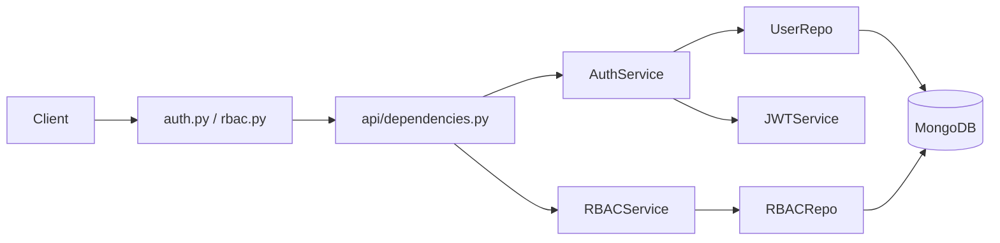

# CODEBASE_CONTEXT - Auth Domain

Last updated: 2026-05-28

This file contains extracted context related to Auth service and RBAC.

## 1. Project Overview (Auth + RBAC)

### 1.1 Purpose and business domain
- Three core concerns are separated:
  - Identity, authentication, RBAC administration.

### 1.2 Architecture style
- Monorepo with service boundaries.
- Microservice runtime:
  - `airc_internal_chatbot_auth` (Auth + RBAC API).
- Layering pattern in backend services:
  - API routers -> dependency injection -> service layer -> repository layer -> MongoDB/Qdrant/Redis.

### 1.3 Technology stack (Auth)

| Area | Stack | Versions / notes |
|---|---|---|
| Auth service | Python + FastAPI + Motor + PyJWT + Passlib | Docker base `python:3.11-slim`; `fastapi>=0.109`, `uvicorn>=0.27` |

## 2. Directory Structure (Auth extract)

```text
airc_internal_chatbot_auth/
|- app/
|  |- main.py                    # FastAPI app, middleware stack, router mounting
|  |- api/
|  |  |- dependencies.py         # Auth/RBAC DI and security dependencies
|  |  |- v1/auth.py              # Auth/user endpoints
|  |  |- v1/rbac.py              # RBAC CRUD/assignment endpoints
|  |- core/                      # settings, mongo connection, rate limiter, security middleware
|  |- models/                    # user + RBAC pydantic schemas
|  |- repositories/              # user/rbac data access
|  |- services/                  # auth, jwt, rbac business logic
|- migrate/                      # DB seed scripts
|- k8s/                          # Auth deployment/service/configmap
```

## 3. Entry Points and Runtime (Auth)

### 3.1 Backend entrypoints
- Auth API entrypoint: `airc_internal_chatbot_auth/app/main.py`
  - mounts `/api/auth` and `/api/rbac`
  - adds security middlewares + rate limiting.

## 4. Core Modules / Components (Auth)

### 4.1 AuthService
- Path: `airc_internal_chatbot_auth/app/services/auth_service.py`
- Responsibility:
  - registration/login, password hashing/verification, JWT issuance, user admin CRUD helper methods.
  - resolves canonical role from `user_roles` mapping.
- Key signatures:

```python
class AuthService:
    def __init__(self, user_repo: UserRepository)
    @staticmethod
    def hash_password(password: str) -> str
    @staticmethod
    def verify_password(plain_password: str, hashed_password: str) -> bool
    async def register(self, user_data: UserCreate) -> Token
    async def login(self, email: str, password: str) -> Token
    async def get_user_by_id(self, user_id: str) -> Optional[UserInDB]
    def verify_token(self, token: str)
    async def get_all_users(self, role_code: Optional[str] = None) -> list[UserInDB]
```

- Depends on:
  - `UserRepository`, `JWTService`, `passlib`.
- Imported by:
  - `app/api/dependencies.py`, `app/api/v1/auth.py`.

### 4.2 JWTService
- Path: `airc_internal_chatbot_auth/app/services/jwt_service.py`
- Responsibility:
  - create/verify JWT with standard claims (`sub`, `iat`, `exp`, `jti`) + custom `email`, `role`.
- Key signatures:

```python
class JWTService:
    @staticmethod
    def create_access_token(user_id: str, email: str, role: str) -> str
    @staticmethod
    def create_refresh_token(user_id: str) -> str
    @staticmethod
    def verify_token(token: str) -> Optional[TokenData]
```

- Depends on:
  - `pyjwt`, `app.core.settings`.
- Imported by:
  - `AuthService`.

### 4.3 RBACService
- Path: `airc_internal_chatbot_auth/app/services/rbac_service.py`
- Responsibility:
  - permission resolution via DB roles/permissions, wildcard checks, in-memory permission cache.
- Key signatures:

```python
class RBACService:
    async def can_manage_system(self, user_id: str) -> bool
    async def check_permission(self, user_id: str, permission_code: str, resource_owner_id: Optional[str] = None) -> bool
    async def get_user_permissions(self, user_id: str) -> List[PermissionResponse]
    async def get_permission_matrix(self) -> dict
```

- Depends on:
  - `RBACRepository`.
- Imported by:
  - `app/api/dependencies.py`, `app/api/v1/auth.py`, `app/api/v1/rbac.py`.

## 5. Data Models and Schemas (Auth-side entities)

### 5.1 Auth-side entities

| Entity | Source | Fields (type) |
|---|---|---|
| User (`users`) | `app/repositories/user_repository.py` + `models/user.py` | `email:str`, `hashed_password:str`, `full_name:str`, `role:str`, `is_active:bool`, `created_at:datetime`, `updated_at?:datetime` |
| Role (`roles`) | `models/rbac.py` + `rbac_repository.py` | `name:str`, `code:str`, `description?:str`, `is_system:bool`, `is_active:bool`, `created_at`, `updated_at?`, `created_by?:ObjectId` |
| Permission (`permissions`) | `models/rbac.py` + `rbac_repository.py` | `name:str`, `code:str`, `resource:str`, `action:str`, `scope?:str`, `description?:str`, `is_system:bool`, `created_at`, `updated_at?`, `created_by?:ObjectId` |
| UserRole (`user_roles`) | `rbac_repository.py` | `user_id:ObjectId`, `role_id:ObjectId`, `assigned_at:datetime`, `assigned_by?:ObjectId`, `expires_at?:datetime` |
| RolePermission (`role_permissions`) | `rbac_repository.py` | `role_id:ObjectId`, `permission_id:ObjectId`, `granted_at:datetime`, `granted_by?:ObjectId` |

## 6. API / Interface Contracts (Auth + RBAC)

### 6.1 Auth API (`/api/auth`)

| Method | Path | Input | Output | Side effects |
|---|---|---|---|---|
| POST | `/register` | `UserCreate` | `Token` | creates user row, hashes password |
| POST | `/login` | `LoginRequest` | `Token` | tracks failed login rate-limit counters |
| POST | `/verify` | `{ token: string }` | `{ id, email, full_name, role, department }` | none (read/verify) |
| POST | `/forgot-password` | placeholder payload | `{message}` | currently stub/no email flow |
| GET | `/me` | bearer token | `UserResponse` | none |
| GET | `/me/permissions` | bearer token | `string[]` | none |
| GET | `/users?role=` | bearer token | `UserResponse[]` | none; employee can only query `intern_guest` |
| POST | `/users` | `UserCreate` | `UserResponse` | admin user creation |
| PATCH | `/users/{user_id}` | `UserUpdate` | `UserResponse` | updates user + optional password hash |
| DELETE | `/users/{user_id}` | path param | `204` | deletes user |

### 6.2 RBAC API (`/api/rbac`)

| Method | Path | Input | Output | Side effects |
|---|---|---|---|---|
| GET | `/permissions` | `include_system?` | `PermissionResponse[]` | none |
| POST | `/permissions` | `PermissionCreate` | `PermissionResponse` | inserts permission, auto-grants to admin role |
| GET | `/permissions/{permission_id}` | path param | `PermissionResponse` | none |
| PATCH | `/permissions/{permission_id}` | `PermissionUpdate` | `PermissionResponse` | updates permission metadata |
| DELETE | `/permissions/{permission_id}` | path param | `204` | deletes non-system permission + mappings |
| GET | `/roles` | `include_inactive?` | `RoleResponse[]` | public endpoint |
| GET | `/roles/{role_id}` | path param | `RoleWithPermissions` | none |
| POST | `/roles` | `RoleCreate` | `RoleResponse` | creates role |
| PATCH | `/roles/{role_id}` | `RoleUpdate` | `RoleResponse` | updates role |
| DELETE | `/roles/{role_id}` | path param | `204` | deletes role + role/user mappings |
| POST | `/roles/{role_id}/permissions` | `GrantPermissionsRequest` | `204` | replaces full role permission set |
| DELETE | `/roles/{role_id}/permissions/{permission_id}` | path params | `204` | removes one mapping |
| POST | `/users/{user_id}/roles` | `AssignRoleRequest` | `204` | assigns role to user |
| DELETE | `/users/{user_id}/roles/{role_id}` | path params | `204` | removes role from user |
| GET | `/users/{user_id}/roles` | path param | `RoleResponse[]` | none |
| GET | `/users/{user_id}/permissions` | path param | `string[]` | none |
| POST | `/users/{user_id}/check-permission` | `PermissionCheckRequest` | `PermissionCheckResponse` | none |
| GET | `/matrix` | none | `PermissionMatrixResponse` | none |

## 7. Business Logic and Rules (Auth + RBAC)

### 7.1 Auth and RBAC rules
- JWT verification and user active check are mandatory in protected routes.
- Role source-of-truth is `user_roles` + `roles` collections, not only `users.role`.
- RBAC admin invariants:
  - cannot create another `admin` role via API.
  - cannot delete admin role.
  - newly created permissions are auto-granted to admin role.
- User list restrictions in auth `/users`:
  - `admin`: any role filter.
  - `employee`: must pass `role=intern_guest` only.

## 8. Configuration and Environment (Auth)

### 8.1 Required env vars (Auth)

| Variable | Required | Default / note |
|---|---|---|
| `JWT_SECRET_KEY` | yes | no default in settings |
| `MONGODB_URL` | no | `mongodb://localhost:27017` |
| `MONGODB_DB_NAME` | no | `airc_auth_db` |
| `JWT_ALGORITHM` | no | `HS256` |
| `JWT_EXPIRE_MINUTES` | no | `1440` |
| `DEBUG` | no | `False` |
| `ALLOWED_ORIGINS` | runtime optional | used by CORS middleware |

## 9. Dependency Graph (Auth)

### 9.1 Auth request path



## 10. Conventions (Auth-related)

### 10.1 Conventions used
- Service/repository naming is explicit (`*Service`, `*Repository`).
- FastAPI dependency wiring is centralized in `api/dependencies.py`.
- Mongo `_id` is serialized to `id` via base repository helpers.
- API versioning:
  - Auth: `/api/auth`, `/api/rbac`

### 10.2 Repeated design patterns
- Repository pattern for database IO.
- Stateful middleware/security stack in Auth (`rate limit`, `security headers`, `request-id`, `input sanitization`, `request-size`).

## 11. Pitfalls (Auth-related)

### 11.1 Important technical debt / anti-patterns
- `airc_internal_chatbot_auth/app/services/auth_service.py` contains debug `print(...)` calls inside login flow.
- Auth rate limiter is in-memory (single-instance semantics, not distributed consistency).

## 12. Quick Answer Index (Auth)

If you need to answer quickly:
- Auth flows and RBAC: `airc_internal_chatbot_auth/app/api/v1/*.py`, `app/services/*.py`.
