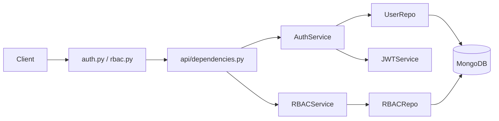

# CODEBASE_CONTEXT - Infra Domain

Last updated: 2026-05-28

This file contains extracted context related to Kubernetes, Docker Compose, environment variables, and config files.

## 1. Project Overview (Infra)

### 1.1 Architecture style
- Monorepo with service boundaries.
- Microservice runtime:
  - `airc_internal_chatbot_auth` (Auth + RBAC API).
  - `airc_internal_chatbot_core` (RAG API + background worker).
  - `airc_internal_chatbot_ui` (Next.js frontend).

### 1.2 Technology stack (Infra)

| Area | Stack | Versions / notes |
|---|---|---|
| Datastores | MongoDB, Redis, Qdrant | Compose: Mongo 6.0, Redis 7-alpine, Qdrant latest |
| Deployment | Docker Compose + Kubernetes manifests | Service-level k8s folders + shared infra in `k8s-infrastructure` |

## 2. Directory Structure (Infra extract)

```text
.
|- docker-compose.local.yml         # Local runtime orchestration (Auth/Core/Worker/UI + Mongo/Redis/Qdrant)
|- airc_internal_chatbot_auth/k8s/  # Auth deployment/service/configmap
|- airc_internal_chatbot_core/k8s/  # Core + worker deployment manifests
|- airc_internal_chatbot_ui/k8s/    # UI deployment/service
|- k8s-infrastructure/              # shared namespace/config/infra/ingress/cloudflared
```

## 3. Entry Points and Runtime (Infra)

### 3.1 Local runtime composition
- `docker-compose.local.yml` starts:
  - `auth_service:8001`, `core_service:8000`, `worker_service`, `ui_service:3000`, `mongodb:27017`, `redis:6379`, `qdrant:6333`.

## 4. Configuration and Environment (Infra)

### 4.1 Required env vars (Auth)

| Variable | Required | Default / note |
|---|---|---|
| `JWT_SECRET_KEY` | yes | no default in settings |
| `MONGODB_URL` | no | `mongodb://localhost:27017` |
| `MONGODB_DB_NAME` | no | `airc_auth_db` |
| `JWT_ALGORITHM` | no | `HS256` |
| `JWT_EXPIRE_MINUTES` | no | `1440` |
| `DEBUG` | no | `False` |
| `ALLOWED_ORIGINS` | runtime optional | used by CORS middleware |

### 4.2 Required env vars (Core)

| Variable | Required | Default / note |
|---|---|---|
| `MONGODB_URL` | yes | no default in settings |
| `JWT_SECRET_KEY` | yes | must match auth design assumption |
| `GEMINI_API_KEY` | yes | required for generation |
| `MONGODB_DB_NAME` | no | `airc_chatbot` |
| `REDIS_URL` | no | `redis://localhost:6379/0` |
| `QDRANT_URL` | no | `http://qdrant:6333` |
| `AUTH_SERVICE_URL` | no | `http://localhost:8001` |
| `GEMINI_MODEL` | no | `models/gemini-2.5-flash` |
| `MAX_UPLOAD_SIZE` | no | `209715200` |
| `DEBUG` | no | `False` |

### 4.3 Required env vars (UI)

| Variable | Required | Note |
|---|---|---|
| `NEXT_PUBLIC_AUTH_API` | yes | expected to include `/api/auth` |
| `NEXT_PUBLIC_API_URL` | yes | expected to include `/api/v1` |
| `NEXT_PUBLIC_APP_URL` | recommended | app absolute URL |

### 4.4 Config files and purpose

| File | Purpose |
|---|---|
| `docker-compose.local.yml` | local integration runtime with all services and dependencies |
| `airc_internal_chatbot_auth/app/core/settings.py` | Auth pydantic settings |
| `airc_internal_chatbot_core/app/core/config.py` | Core pydantic settings |
| `airc_internal_chatbot_ui/next.config.ts` | Next build behavior (`output: standalone`) |
| `airc_internal_chatbot_ui/src/infrastructure/http/*.ts` | axios base URL + auth interceptors |
| `k8s-infrastructure/*` | shared K8s namespace/config/infra/ingress/cloudflared |

## 5. Dependency Graph (Infra-level critical paths)

### 5.1 Auth request path



### 5.2 Core chat path

```mermaid
graph LR
  UI --> ChatAPI[/api/v1/chat/ask]
  ChatAPI --> CoreDeps[get_current_user]
  CoreDeps --> AuthVerify[POST /api/auth/verify]
  ChatAPI --> ChatService
  ChatService --> Embed
  ChatService --> Cache
  ChatService --> Vector[Qdrant search]
  ChatService --> ChunkRepo
  ChatService --> Rerank
  ChatService --> Prompt
  ChatService --> LLM[Gemini]
  ChatService --> SessionRepo
  ChunkRepo --> Mongo[(MongoDB)]
  SessionRepo --> Mongo
```

### 5.3 Ingest path

```mermaid
graph LR
  UI --> AddFilesAPI[/api/v1/datasets/{id}/files]
  AddFilesAPI --> Queue[Redis RQ ingest queue]
  Queue --> Worker[worker.py]
  Worker --> IngestJob[app/jobs/ingest.py]
  IngestJob --> ProcessingService
  ProcessingService --> FileSystem[(uploads/)]
  ProcessingService --> ChunkRepo
  ProcessingService --> VectorSvc
  ChunkRepo --> Mongo[(MongoDB)]
  VectorSvc --> Qdrant[(Qdrant)]
```

## 6. Conventions (Infra-related)

### 6.1 Conventions used
- API versioning:
  - Auth: `/api/auth`, `/api/rbac`
  - Core: `/api/v1/*`

## 7. Pitfalls (Infra-related)

### 7.1 Important technical debt / anti-patterns
- `k8s-infrastructure/kustomization.yaml` references `secrets/shared-secrets.yaml` but this path is missing in repository.
- `k8s-infrastructure/cloudflared/deployment.yaml` contains a hardcoded tunnel token in manifest.
- Managed certificate domains and ingress host differ in infra manifests.
