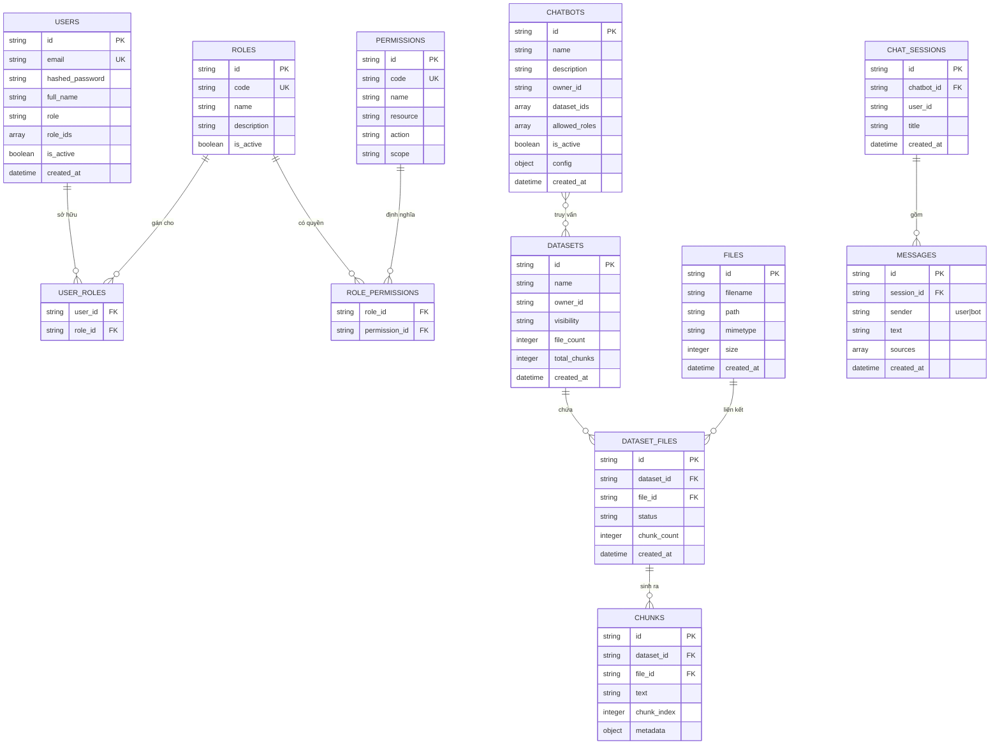
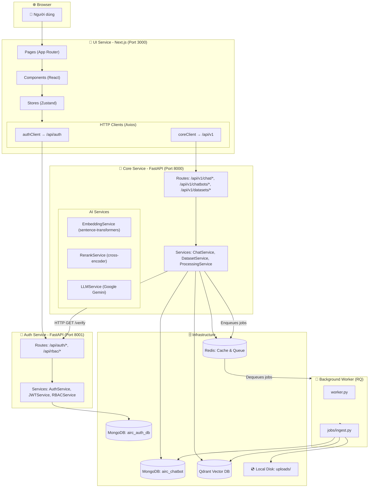
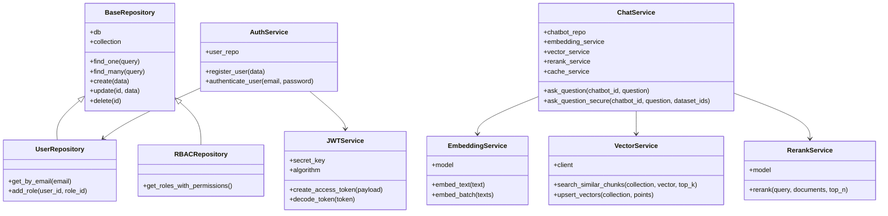
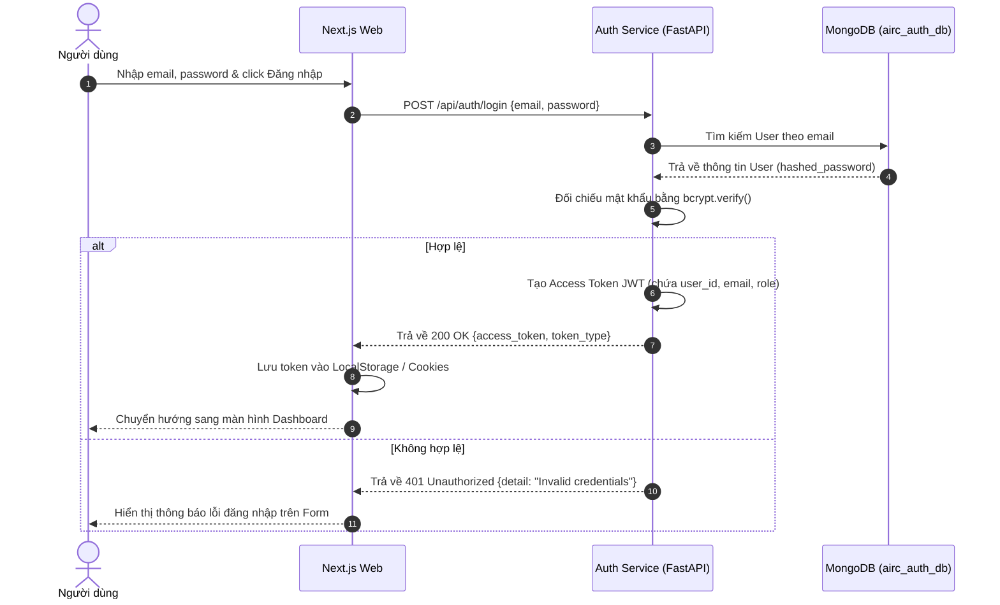
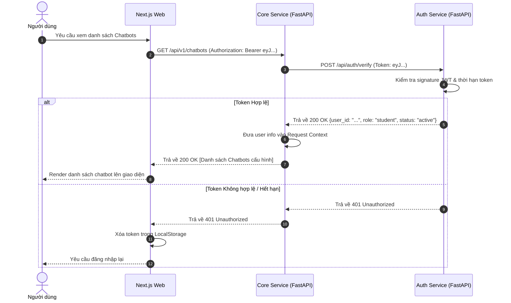
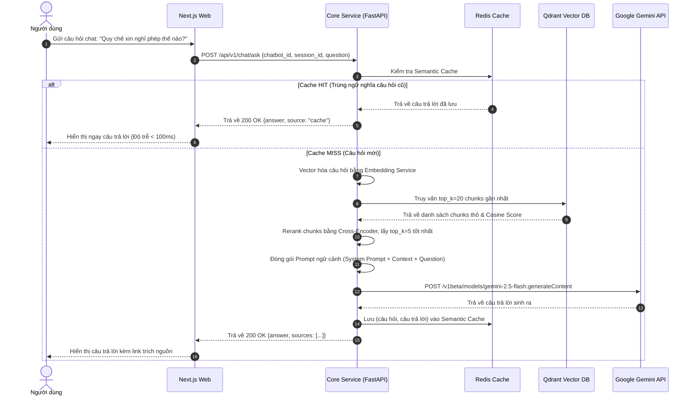
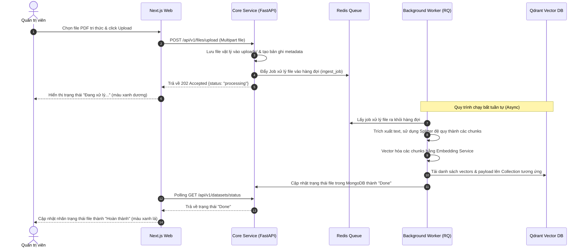

# 📑 BÁO CÁO KỸ THUẬT: HỆ THỐNG TRỢ LÝ ẢO TRA CỨU TRI THỨC NỘI BỘ (AIRC INTERNAL CHATBOT)

> **Đơn vị thực hiện:** Nhóm Nghiên cứu & Phát triển AIRC  
> **Phiên bản:** 1.0.0 (Bản chính thức)  
> **Ngôn ngữ:** Tiếng Việt  
> **Màu sắc hiển thị:** Đen (Tiêu chuẩn tài liệu kỹ thuật doanh nghiệp)  

---

## 📊 MỤC LỤC CHI TIẾT
1. [Lời Mở Đầu](#lời-mở-đầu)
2. [Chương 1: Giới Thiệu Dự Án & Đặc Tả Các Chức Năng Hệ Thống](#chương-1-giới-thiệu-dự-án--đặc-tả-các-chức-năng-hệ-thống)
   - 1.1. Giới thiệu sơ bộ về dự án
   - 1.2. Đặc tả các phân hệ chức năng của hệ thống
3. [Chương 2: Cơ Sở Lý Thuyết Và Công Nghệ](#chương-2-cơ-sở-lý-thuyết-và-công-nghệ)
   - 2.1. Tổng quan về Retrieval-Augmented Generation (RAG)
   - 2.2. Cơ sở lý thuyết về Xử lý dữ liệu văn bản và Vector Database
   - 2.3. Kỹ thuật sắp xếp lại kết quả (Reranking)
   - 2.4. Kiến trúc Microservices và Bảo mật RBAC
   - 2.5. Stack công nghệ lựa chọn và lý do
4. [Chương 3: Phân Tích Và Thiết Kế Hệ Thống](#chương-3-phân-tích-và-thiết-kế-hệ-thống)
   - 3.1. Đặc tả yêu cầu hệ thống (Yêu cầu chức năng & phi chức năng)
   - 3.2. Sơ đồ Usecase hệ thống
   - 3.3. Thiết kế Cơ sở dữ liệu (Database Design - MongoDB & Qdrant)
   - 3.4. Thiết kế Kiến trúc Hệ thống
   - 3.5. Thiết kế Sơ đồ Lớp (Class Diagram)
   - 3.6. Thiết kế Luồng tuần tự (Sequence Diagrams)
5. [Chương 4: Thiết Kế Giao Diện (Mockups)](#chương-4-thiết-kế-giao-diện-mockups)
   - 4.1. Sơ đồ cây màn hình
   - 4.2. Đặc tả UI Đăng nhập & Đăng ký
   - 4.3. Đặc tả UI Dashboard & Quản lý Hệ thống
   - 4.4. Đặc tả UI Quản lý Datasets & Tri thức tài liệu
   - 4.5. Đặc tả UI Cấu hình Chatbot
   - 4.6. Giao diện Trò chuyện RAG & Bảng gỡ lỗi
6. [Chương 5: Hiện Thực Hóa Và Kiểm Thử](#chương-5-hiện-thực-hóa-và-kiểm-thử)
   - 5.1. Cấu trúc mã nguồn thực tế
   - 5.2. Hiện thực hóa các thuật toán & Kỹ thuật then chốt
   - 5.3. Cấu hình triển khai hệ thống (Docker Compose & Kubernetes GKE)
   - 5.4. Kịch bản kiểm thử và Kết quả thực tế
7. [Chương 6: Kết Luận Và Hướng Phát Triển](#chương-6-kết-luận-và-hướng-phát-triển)
   - 6.1. Kết quả đạt được của hệ thống
   - 6.2. Hạn chế còn tồn tại
   - 6.3. Hướng phát triển tương lai
8. [Phụ Lục: Hướng Dẫn Cài Đặt Nhanh](#phụ-lục-hướng-dẫn-cài-đặt-nhanh)

---

## LỜI MỞ ĐẦU
Tài liệu này là Báo cáo kỹ thuật chính thức và toàn diện của dự án "Hệ thống Trợ lý ảo tra cứu tri thức nội bộ - AIRC Internal Chatbot". Nội dung tài liệu tập trung mô tả chi tiết kiến trúc hệ thống, đặc tả các phân hệ chức năng hiện có, thiết kế dữ liệu và các quy trình luồng xử lý thực tế của dự án. 

Báo cáo kỹ thuật được cấu trúc thành các nội dung trọng tâm sau:
*   **Tổng quan và Đặc tả Chức năng:** Trình bày bối cảnh dự án và làm rõ nghiệp vụ của 5 phân hệ chức năng cốt lõi bao gồm Xác thực & RBAC, Quản lý tài liệu tri thức, Cấu hình Chatbot, Trò chuyện RAG và Bảng điều khiển gỡ lỗi (Debug Console).
*   **Cơ sở Công nghệ & Lý thuyết:** Phân tích nguyên lý của pipeline Retrieval-Augmented Generation (RAG) nâng cao, bao gồm giải thuật chia nhỏ văn bản đệ quy, kỹ thuật lưu trữ vector index (Qdrant), cơ chế xếp hạng lại Cross-Encoder Reranker, và hệ thống Semantic Cache sử dụng Redis để tối ưu hóa thời gian phản hồi.
*   **Phân tích & Thiết kế Hệ thống:** Cung cấp các thiết kế trực quan thông qua sơ đồ Use Case, sơ đồ thực thể mối quan hệ (ERD) cho MongoDB và Qdrant, sơ đồ Class, thiết kế kiến trúc Microservices phân tách độc lập và các sơ đồ Sequence thể hiện luồng truyền nhận thông tin liên dịch vụ.
*   **Thiết kế Giao diện (Mockups):** Đặc tả chi tiết giao diện người dùng (UI/UX) cho cả phân hệ Client (Chat RAG) và phân hệ Quản trị (Dashboard, Datasets, Chatbot Customizer) với các chỉ số đo lường trực quan.
*   **Hiện thực hóa & Kiểm thử:** Minh họa cấu trúc thư mục dự án thực tế, các đoạn mã nguồn then chốt cho luồng RAG và Background Worker xử lý dữ liệu ngầm, cấu hình triển khai hệ thống (Docker Compose, Kubernetes GKE) cùng các kịch bản kiểm thử (Test Cases) thực tế.

Tài liệu này được biên soạn với mục đích làm cẩm nang hướng dẫn bàn giao công nghệ, phục vụ công tác bảo trì, vận hành và phát triển mở rộng hệ thống tại Viện Công nghệ Thông tin - Đại học Quốc gia Hà Nội (AIRC).

---

## CHƯƠNG 1: GIỚI THIỆU DỰ ÁN & ĐẶC TẢ CÁC CHỨC NĂNG HỆ THỐNG

### 1.1. Giới thiệu sơ bộ về dự án
Dự án "AIRC Internal Chatbot" được khởi xướng nhằm giải quyết nhu cầu tra cứu và xử lý thông tin nội bộ tự động, hiệu quả và bảo mật cao tại Viện Công nghệ Thông tin - Đại học Quốc gia Hà Nội (AIRC). Trong hoạt động hàng ngày, cán bộ, giảng viên và sinh viên tại Viện phải tiếp cận và thực thi theo một lượng lớn các tài liệu hướng dẫn học vụ, quy chế tổ chức hành chính, thông tư đào tạo và tài liệu kỹ thuật nghiên cứu. Cách thức tra cứu truyền thống (sử dụng chức năng tìm kiếm từ khóa Ctrl+F trên từng tài liệu PDF đơn lẻ hoặc đọc thủ công) bộc lộ nhiều điểm hạn chế: tốc độ chậm, dễ bỏ sót nội dung liên quan giữa các văn bản khác nhau, và không có khả năng tổng hợp thông tin đa nguồn.

Hệ thống AIRC Internal Chatbot khắc phục hoàn toàn những nhược điểm trên bằng cách áp dụng công nghệ Retrieval-Augmented Generation (RAG). Hệ thống cho phép người dùng đặt câu hỏi bằng ngôn ngữ tự nhiên và nhận về câu trả lời tổng hợp chính xác, kèm trích nguồn chi tiết đến từng phân đoạn tài liệu gốc. Đồng thời, hệ thống cung cấp các giao diện quản trị trực quan để tải lên tài liệu, phân nhóm tri thức (Datasets), cấu hình tham số mô hình ngôn ngữ lớn (LLM), và phân quyền sử dụng linh hoạt. Việc thiết kế hệ thống theo kiến trúc Microservices giúp phân tách độc lập giữa dịch vụ xác thực (Auth Service) và dịch vụ nghiệp vụ chính (Core Service), đảm bảo khả năng mở rộng hệ thống và dễ dàng tích hợp thêm các dịch vụ bổ trợ trong tương lai.

### 1.2. Đặc tả các phân hệ chức năng của hệ thống
Hệ thống được chia thành 5 phân hệ chức năng cốt lõi. Dưới đây là đặc tả chi tiết về mặt nghiệp vụ và kỹ thuật cho từng phân hệ:

#### 1.2.1. Phân hệ Xác thực & Quản lý Phân quyền (Authentication & RBAC)
Phân hệ này đảm nhận vai trò là chốt chặn bảo mật đầu tiên của toàn hệ thống, cung cấp cơ chế quản lý tài khoản người dùng và kiểm soát quyền truy cập tài nguyên dựa trên vai trò (Role-Based Access Control - RBAC). Các chức năng chính bao gồm:
*   **Đăng ký tài khoản mới:** Người dùng cung cấp email hợp lệ (tên miền nội bộ `@airc.vnu.edu.vn` hoặc `@vnu.edu.vn`), mật khẩu bảo mật và họ tên đầy đủ. Hệ thống mã hóa mật khẩu bằng thuật toán bcrypt trước khi lưu vào cơ sở dữ liệu.
*   **Đăng nhập hệ thống:** Xác thực thông tin tài khoản và cấp phát JSON Web Token (JWT) Access Token có thời hạn sử dụng. Token này chứa thông tin định danh và vai trò của người dùng.
*   **Quản lý vai trò (Roles) và quyền hạn (Permissions):** Hệ thống định nghĩa sẵn 3 vai trò chính bao gồm Admin (Quản trị viên hệ thống), Teacher (Giảng viên/Cán bộ quản lý tri thức), và Student (Sinh viên/Người dùng cuối). Mỗi vai trò được gán tập hợp các quyền cụ thể (ví dụ: `dataset:create`, `file:upload`, `chatbot:chat`).
*   **Kiểm soát truy cập API:** Mọi API Endpoint yêu cầu bảo mật đều được bảo vệ bởi middleware kiểm tra quyền hạn của JWT Token gửi kèm từ client, ngăn chặn các hành vi leo thang đặc quyền.

#### 1.2.2. Phân hệ Quản lý Tài liệu & Tri thức (Knowledge Base Management)
Phân hệ này cho phép người dùng có vai trò phù hợp (Admin, Teacher) xây dựng và quản trị cơ sở tri thức dưới dạng các bộ dữ liệu logic (Datasets). Các chức năng chính bao gồm:
*   **Khởi tạo và quản lý Dataset:** Tạo mới các thư mục tri thức theo chuyên mục cụ thể (ví dụ: Quy chế Đào tạo, Hướng dẫn Nghiên cứu Khoa học). Cấu hình chế độ hiển thị (Public/Private) và gán quyền sở hữu.
*   **Tải lên tài liệu (File Uploading):** Hỗ trợ các định dạng tệp thông dụng như PDF, DOCX, TXT. File sau khi upload được lưu trữ vật lý an toàn và tạo bản ghi metadata tương ứng trong MongoDB.
*   **Giám sát tiến trình xử lý dữ liệu:** Khi tài liệu được thêm vào Dataset, hệ thống kích hoạt luồng xử lý ngầm (Background Worker) để trích xuất chữ, chia nhỏ (chunking) và vector hóa (embedding). Trạng thái xử lý của từng tệp được cập nhật liên tục (Pending -> Chunking -> Embedding -> Done hoặc Error) hiển thị trực quan lên UI cho người dùng theo dõi.
*   **Bật/Tắt tài liệu:** Cho phép người quản trị tạm thời vô hiệu hóa hoặc kích hoạt lại một tài liệu cụ thể trong Dataset mà không cần xóa file, giúp kiểm soát linh hoạt nguồn thông tin truy xuất.

#### 1.2.3. Phân hệ Cấu hình & Quản lý Chatbot (Chatbot Customizer)
Phân hệ này cung cấp công cụ cho phép Admin tạo lập và tinh chỉnh cấu hình hoạt động cho từng Chatbot phục vụ các mục đích tra cứu khác nhau. Các cấu hình cụ thể bao gồm:
*   **Liên kết Dataset:** Chọn một hoặc nhiều bộ tri thức làm cơ sở dữ liệu nền cho chatbot truy vấn thông tin.
*   **Hệ thống lời nhắc (System Prompt):** Định nghĩa tính cách, vai trò và phạm vi ứng xử của chatbot (ví dụ: \"Bạn là trợ lý học vụ của Viện AIRC, chỉ trả lời dựa trên tài liệu được cung cấp...\").
*   **Chọn mô hình LLM:** Hỗ trợ cấu hình sử dụng các mô hình khác nhau của Google Gemini (Gemini 2.5 Flash, Gemini 1.5 Pro).
*   **Tham số RAG:** Điều chỉnh số lượng phân đoạn truy xuất tối đa (top_k), ngưỡng độ tương đồng tối thiểu (similarity_threshold), nhiệt độ sáng tạo (Temperature) và mô hình reranking.
*   **Phân quyền truy cập chatbot:** Xác định danh sách các vai trò được phép tương tác chat (`allowed_roles`), tránh rò rỉ thông tin nhạy cảm của tổ chức.

#### 1.2.4. Phân hệ Trò chuyện RAG & Tối ưu phản hồi (RAG Chat Engine)
Đây là giao diện tương tác trực tiếp của người dùng cuối với Chatbot. Phân hệ tích hợp các kỹ thuật tối ưu hiệu năng và chất lượng sinh câu trả lời:
*   **Giao diện hội thoại thời gian thực:** Hỗ trợ luồng text streaming (trả kết quả từ LLM dạng cuốn chiếu), tạo trải nghiệm trò chuyện mượt mà.
*   **Trích xuất nguồn tham chiếu (Source Citation):** Hiển thị danh sách các tài liệu nguồn (tên file, số trang, đoạn văn thô được dùng làm căn cứ) ngay dưới câu trả lời của Bot, giúp người dùng dễ dàng đối chiếu, kiểm chứng tính xác thực.
*   **Quản lý phiên chat (Chat Sessions):** Tự động lưu trữ lịch sử hội thoại của người dùng, cho phép xem lại hoặc xóa các phiên trò chuyện cũ.
*   **Semantic Cache (Tối ưu hóa bằng Redis):** Hệ thống sử dụng Redis để lưu trữ các cặp câu hỏi - câu trả lời đã xử lý. Khi người dùng gửi câu hỏi mới, hệ thống tính toán khoảng cách vector. Nếu câu hỏi trùng hoặc tương đồng cao với câu hỏi cũ trong cache, hệ thống sẽ trả về câu trả lời ngay lập tức mà không cần gọi mô hình LLM, giúp tiết kiệm chi phí API và hạ độ trễ xuống dưới 100ms.

#### 1.2.5. Phân hệ Kiểm soát & Gỡ lỗi RAG (Debug Console)
Phân hệ này được thiết kế dành riêng cho quản trị viên và kỹ sư hệ thống để theo dõi và tinh chỉnh chất lượng của pipeline RAG. Các chức năng chính bao gồm:
*   **Đo lường độ trễ chi tiết:** Hiển thị thời gian thực hiện (Latency Metrics) của từng bước trong chuỗi RAG bao gồm: Embedding (tạo vector câu hỏi), Vector Search (tìm kiếm trên Qdrant), Reranking (sắp xếp lại phân đoạn), và LLM Generation (mô hình sinh câu trả lời).
*   **Xem trước phân đoạn thô (Raw Chunks Preview):** Cho phép xem trực tiếp danh sách các văn bản thô được truy xuất kèm theo điểm số tương đồng cosine (Cosine Score) và điểm số sau khi rerank (Rerank Score), giúp chẩn đoán nguyên nhân chatbot trả lời sai lệch hoặc thiếu thông tin.

---

## CHƯƠNG 2: CƠ SỞ LÝ THUYẾT VÀ CÔNG NGHỆ

### 2.1. Tổng quan về Retrieval-Augmented Generation (RAG)
Mô hình Ngôn ngữ Lớn (LLM) đã chứng minh khả năng vượt trội trong việc hiểu và sinh văn bản tự nhiên. Tuy nhiên, khi áp dụng vào môi trường doanh nghiệp và tổ chức, LLM bộc lộ hai nhược điểm chí tử: một là hiện tượng \"ảo tưởng\" (hallucination) - tự tin tạo ra các thông tin không có thực nhưng nghe rất hợp lý; hai là giới hạn về mặt tri thức - LLM chỉ biết các thông tin có trong tập dữ liệu huấn luyện của nó và hoàn toàn không có thông tin về các tài liệu nội bộ, bảo mật của tổ chức. Phương pháp tinh chỉnh mô hình (Fine-tuning) mặc dù giúp LLM học thêm kiến thức mới nhưng đòi hỏi chi phí tính toán cực kỳ lớn, quy trình chuẩn bị dữ liệu phức tạp và khó cập nhật tri thức mới theo thời gian thực.

Công nghệ Retrieval-Augmented Generation (RAG) ra đời để giải quyết triệt để vấn đề này bằng cách kết hợp khả năng truy xuất thông tin từ một kho tri thức bên ngoài với năng lực tổng hợp và sinh văn bản của LLM. Bảng dưới đây so sánh chi tiết hai phương pháp tiếp cận RAG và Fine-tuning:

| Tiêu chí so sánh | Retrieval-Augmented Generation (RAG) | Fine-Tuning |
| :--- | :--- | :--- |
| **Chi phí tính toán** | Thấp (chỉ cần chạy mô hình Embedding và truy vấn Vector DB) | Rất cao (yêu cầu hạ tầng GPU mạnh để huấn luyện lại trọng số) |
| **Khả năng cập nhật tri thức** | Tức thời (chỉ cần thêm/sửa file tri thức trong Vector DB) | Chậm (phải chạy lại quy trình huấn luyện để cập nhật kiến thức) |
| **Trích nguồn dữ liệu** | Có (có thể chỉ rõ tên tệp tin, dòng chữ làm căn cứ) | Không (tri thức được phân bổ ngầm vào trọng số mô hình) |
| **Hiện tượng ảo tưởng** | Thấp (được ràng buộc chặt chẽ bởi ngữ cảnh truy xuất) | Trung bình - Cao (vẫn tự do sinh chữ dựa trên xác suất) |
| **Yêu cầu dữ liệu huấn luyện** | Không cần chuẩn bị tập dữ liệu Q&A phức tạp | Cần tập dữ liệu huấn luyện lớn và được gán nhãn chuẩn xác |

Quy trình hoạt động chuẩn của hệ thống RAG gồm 3 giai đoạn chính:
1.  **Xử lý & Nạp liệu (Ingestion):** Tài liệu thô được trích xuất văn bản, chia nhỏ thành các đoạn ngắn (chunks), chuyển đổi thành các vector đặc trưng (embeddings) và lưu vào cơ sở dữ liệu vector.
2.  **Truy xuất (Retrieval):** Khi người dùng đưa ra câu hỏi, câu hỏi được vector hóa và dùng để tìm kiếm các phân đoạn tài liệu có độ tương đồng ngữ nghĩa cao nhất trong Vector DB.
3.  **Tổng hợp (Generation):** Các phân đoạn tài liệu tìm được cùng câu hỏi gốc được đóng gói vào một prompt ngữ cảnh gửi tới LLM. LLM đọc hiểu ngữ cảnh và viết câu trả lời chính xác.

### 2.2. Cơ sở lý thuyết về Xử lý dữ liệu văn bản và Vector Database

#### 2.2.1. Kỹ thuật chia nhỏ văn bản (Text Chunking)
Tài liệu nghiệp vụ thường rất dài (hàng chục đến hàng trăm trang). Việc đưa toàn bộ nội dung tài liệu vào prompt gửi lên LLM là không khả thi do giới hạn cửa sổ ngữ cảnh (Context Window Limit) của mô hình và chi phí token tăng vọt. Do đó, tài liệu cần được chia nhỏ thành các phân đoạn có kích thước hợp lý gọi là chunks. 

Nếu kích thước chunk quá nhỏ, ngữ cảnh của thông tin sẽ bị xé lẻ và mất đi tính liên kết ý nghĩa. Nếu kích thước chunk quá lớn, kết quả truy xuất sẽ chứa nhiều thông tin rác không liên quan, làm loãng câu trả lời và lãng phí tài nguyên xử lý của LLM.

Để tối ưu hóa cho tiếng Việt và các định dạng tài liệu Markdown phổ biến trong dự án, hệ thống đã triển khai bộ xử lý `ChunkingService` tùy chỉnh. Quy trình phân đoạn hoạt động theo các bước:
1. **Chuẩn hóa văn bản:** Loại bỏ các khoảng trắng thừa, đồng bộ hóa các dấu xuống dòng lặp lại về dạng phân đoạn chuẩn `\n\n` thông qua hàm `normalize_vietnamese_text`.
2. **Tách khối (Block Splitting):** Phân tách văn bản thành các khối văn bản thường và các khối bảng biểu Markdown độc lập (dựa trên việc phát hiện ký tự '|' xuất hiện từ 2 lần trở lên trên mỗi dòng).
3. **Xử lý bảng biểu lớn (`_split_large_table`):** Đối với các bảng Markdown vượt quá kích thước chunk, thuật toán tự động chia nhỏ bảng và chèn lặp lại tiêu đề bảng (header) ở đầu mỗi phần để giữ nguyên ngữ cảnh cột khi vector hóa và truy xuất.
4. **Chia nhỏ đệ quy cho văn bản thường (`_split_recursive`):** Sử dụng thuật toán chia đệ quy với danh sách ký tự ngắt câu tiếng Việt ưu tiên từ cao xuống thấp (`\n\n`, `\n`, `. `, `! `, `? `, `; `, `: `, `, `, ` `).

Mỗi phân đoạn văn bản thông thường sau khi chia được cấu hình mặc định có kích thước tối đa 1024 ký tự và khoảng chồng lấn (overlap) là 20 ký tự để bảo toàn thông tin ngữ cảnh tại các điểm cắt.

    Bên cạnh quy trình chia nhỏ cơ bản, `ChunkingService` tích hợp các kỹ thuật nâng cao nhằm giải quyết triệt để bài toán mất mát ngữ cảnh trong RAG:
    *   **Phân loại cấu trúc tự động (Auto-Profiling & Section Parsing):** Trước khi chia nhỏ, hệ thống sử dụng module `DocumentProfiler` để tự động nhận diện miền tài liệu (như `legal` - pháp lý, `financial` - tài chính, `faq` - hỏi đáp, `general` - chung). Dựa trên miền tài liệu đó, hệ thống áp dụng bộ phân tích section phù hợp (`MarkdownParser` cho định dạng thẻ tiêu đề, `LegalParser` cho cấu trúc Chương/Điều, `NumberedParser` cho văn bản đánh số phân cấp `1.`, `1.1`, hoặc `FallbackParser` cho văn bản phi cấu trúc).
    *   **Chiến lược Parent-Child Chunking (Parent-Child Policy):** Với các tài liệu có độ dài và độ phức tạp cao, hệ thống không chỉ lập chỉ mục (index) các phân đoạn con độc lập (Child Chunks - kích thước nhỏ để tìm kiếm vector tối ưu). Thay vào đó, hệ thống liên kết các Child Chunks này với một phân đoạn cha lớn hơn chứa toàn bộ ngữ cảnh xung quanh (Parent Chunks - kích thước từ 3000 đến 5000 ký tự). Khi tìm kiếm, hệ thống khớp ngữ nghĩa dựa trên Child Chunks nhưng sẽ trả về và gửi nội dung của Parent Chunks cho LLM sinh câu trả lời, đảm bảo tính đầy đủ và chính xác của thông tin.
    *   **Bảo toàn phân cấp pháp lý và làm giàu ngữ cảnh (Context Enrichment):** Đối với tài liệu thuộc miền pháp lý, hệ thống chia nhỏ đệ quy sâu theo cấu trúc thứ bậc quy phạm pháp luật: `Khoản -> Điểm -> Câu`. Đồng thời, hệ thống tự động sinh tiền tố thông tin phong phú (Rich Context) đính kèm vào đầu mỗi chunk con (ví dụ: `[Tài liệu: Quy chế tuyển dụng | Mục: Điều 5 - Khoản 2 - Điểm a]`). Cơ chế này giúp các chunk con khi đứng riêng lẻ trong cơ sở dữ liệu vector vẫn mang đầy đủ thông tin định danh nguồn gốc ngữ cảnh, tăng cường độ chính xác khi tìm kiếm ngữ nghĩa.

#### 2.2.2. Vector Embedding
Máy tính không thể hiểu trực tiếp ngữ nghĩa của từ ngữ dưới dạng chuỗi ký tự thông thường. Công nghệ Vector Embedding giải quyết vấn đề này bằng cách sử dụng các mô hình học sâu để chuyển đổi một đoạn văn bản thành một chuỗi số thực có số chiều cố định là **768 chiều**. Chuỗi số này đại diện cho tọa độ của đoạn văn bản đó trong một không gian ngữ nghĩa nhiều chiều. Hai đoạn văn bản có nội dung ngữ nghĩa tương đồng hoặc liên quan chặt chẽ với nhau (ví dụ: "quy chế nghỉ phép" và "thủ tục xin nghỉ việc riêng") sẽ được biểu diễn bởi hai vector nằm gần nhau trong không gian này, bất kể chúng có sử dụng chung các từ khóa ký tự cụ thể hay không.

Hệ thống sử dụng mô hình Embedding chuyên dụng tối ưu cho tiếng Việt: `keepitreal/vietnamese-sbert` (dựa trên kiến trúc SBERT - Sentence-BERT) chạy cục bộ thông qua thư viện `sentence-transformers`. Mô hình này giúp nắm bắt tốt các sắc thái từ vựng và cấu trúc ngữ pháp đặc thù của tiếng Việt hơn các mô hình đa ngôn ngữ tổng quát.

#### 2.2.3. Cơ sở dữ liệu Vector (Vector Database - Qdrant)
Cơ sở dữ liệu quan hệ truyền thống (SQL) được tối ưu cho việc tìm kiếm chính xác theo trường dữ liệu hoặc từ khóa thô (exact match). Tuy nhiên, đối với hàng triệu vector nhiều chiều, việc thực hiện so sánh tuyến tính toàn bộ dữ liệu (brute-force search) để tìm vector gần nhất có độ phức tạp thuật toán là $O(N)$, gây tắc nghẽn nghiêm trọng khi số lượng chunk tăng lớn.

Qdrant là một Vector Database mã nguồn mở hiệu năng cao được viết bằng ngôn ngữ Rust, hỗ trợ lưu trữ và truy vấn vector hàng triệu chiều. Qdrant sử dụng cấu trúc chỉ mục HNSW (Hierarchical Navigable Small World) - một đồ thị nhiều lớp cho phép thực hiện thuật toán tìm kiếm láng giềng gần đúng (Approximate Nearest Neighbor - ANN) với độ phức tạp cực thấp chỉ là $O(\log N)$. Độ tương đồng ngữ nghĩa giữa câu hỏi của người dùng và các chunks được tính toán thông qua công thức độ tương đồng Cosine (Cosine Similarity):

$$\text{Cosine Similarity} = \frac{\mathbf{A} \cdot \mathbf{B}}{\|\mathbf{A}\| \|\mathbf{B}\|}$$

Giá trị Cosine Similarity nằm trong khoảng [-1, 1], trong đó giá trị càng gần 1 thể hiện độ tương đồng ngữ nghĩa càng cao.

### 2.3. Kỹ thuật sắp xếp lại kết quả (Reranking)
Trong các hệ thống RAG cơ bản, giai đoạn truy xuất sử dụng cấu trúc Bi-Encoder (như mô hình Embedding thông thường). Bi-Encoder mã hóa độc lập câu hỏi và tài liệu thành các vector riêng lẻ, sau đó chỉ thực hiện so sánh tích vô hướng. Phương pháp này chạy rất nhanh nhưng bỏ qua mối quan hệ tương tác trực tiếp giữa các từ ngữ trong câu hỏi và tài liệu, dẫn đến việc nhiều tài liệu chứa từ khóa giống nhau nhưng không liên quan ngữ cảnh vẫn có điểm số tương đồng rất cao.

Hệ thống AIRC Internal Chatbot giải quyết triệt để điểm yếu này bằng việc bổ sung Cross-Encoder Reranker vào sau bước tìm kiếm vector. Hệ thống hỗ trợ cấu hình linh hoạt các mô hình Cross-Encoder thông qua UI bao gồm:
- **`cross-encoder/ms-marco-MiniLM-L-6-v2` (MiniLM-L6):** Mô hình mặc định, siêu nhẹ, thời gian xử lý khoảng 100-200ms cho 10 chunks trên CPU, cân bằng tối ưu giữa tốc độ và độ chính xác.
- **`cross-encoder/ms-marco-MiniLM-L-12-v2` (MiniLM-L12):** Mô hình tầm trung, thời gian xử lý khoảng 200-400ms trên CPU, cho độ chính xác cao hơn.
- **`BAAI/bge-reranker-v2-m3` (BGE-M3 Reranker):** Mô hình hạng nặng, hỗ trợ đa ngôn ngữ tối ưu, cho độ chính xác cao nhất đối với tiếng Việt và các câu hỏi phức tạp, thời gian xử lý khoảng 2-8s trên CPU.

Cross-Encoder nhận đầu vào là cặp câu hỏi và đoạn văn bản cùng một lúc, cho phép mô hình chú ý chéo (cross-attention) giữa tất cả các từ của câu hỏi và tài liệu. Kết quả trả về là một điểm số tương quan (Relevance Score) cực kỳ chính xác. Nhờ cơ chế này, hệ thống có thể lọc bỏ các phân đoạn nhiễu, sắp xếp lại thứ tự ưu tiên của các phân đoạn và chỉ gửi những thông tin thực sự giá trị nhất lên LLM, giúp tối ưu hóa độ chính xác của câu trả lời sinh ra.

### 2.4. Kiến trúc Microservices và Bảo mật RBAC
Kiến trúc Microservices phân rã một hệ thống phần mềm lớn thành các dịch vụ nhỏ chạy độc lập, giao tiếp với nhau qua các giao thức mạng chuẩn (như HTTP RESTful API). Cách tiếp cận này mang lại nhiều lợi thế kỹ thuật lớn cho dự án:
*   **Khả năng mở rộng độc lập (Independent Scalability):** Dịch vụ Core Service xử lý AI/RAG nặng có thể được scale lên nhiều replica trên cụm Kubernetes khi số lượng yêu cầu chat tăng, trong khi dịch vụ Auth Service nhẹ nhàng chỉ cần duy trì số lượng tài nguyên tối thiểu.
*   **Cách ly lỗi (Fault Isolation):** Sự cố sập dịch vụ Core Service do nghẽn mô hình AI không làm ảnh hưởng đến khả năng đăng nhập hoặc quản trị người dùng của dịch vụ Auth Service.

Mặt khác, bảo mật hệ thống được thiết kế chặt chẽ thông qua mô hình phân quyền dựa trên vai trò (Role-Based Access Control - RBAC) kết hợp với cơ chế xác thực phi tập trung sử dụng JSON Web Token (JWT). JWT Token được ký số bởi Auth Service bằng khóa bí mật chỉ chia sẻ giữa các service nội bộ. Khi nhận request từ Client, Core Service chỉ cần tự giải mã và kiểm tra chữ ký của token để xác thực danh tính và vai trò người dùng mà không cần phải thực hiện truy vấn trực tiếp vào database của Auth Service ở mỗi request, giúp giảm thiểu tối đa độ trễ hệ thống.

### 2.5. Stack công nghệ lựa chọn và lý do

| Thành phần | Công nghệ lựa chọn | Lý do lựa chọn kỹ thuật |
| :--- | :--- | :--- |
| **Backend API** | FastAPI (Python) | Hỗ trợ async/await IO không đồng bộ vượt trội, tốc độ thực thi tiệm cận Go/Node.js. Tích hợp sẵn Pydantic để validate dữ liệu chặt chẽ và tự động sinh tài liệu API dạng Swagger UI. |
| **Frontend UI** | Next.js (React) & Zustand | Next.js hỗ trợ cơ chế Server-Side Rendering (SSR) giúp tối ưu hóa tốc độ tải trang ban đầu. Zustand được chọn làm state manager thay thế cho Redux nhờ dung lượng siêu nhẹ, cú pháp đơn giản, giảm thiểu số lần re-render component dư thừa. |
| **Vector DB** | Qdrant | Viết bằng Rust, hiệu năng cực cao, hỗ trợ phân mảnh dữ liệu (sharding) tốt, API thân thiện và hỗ trợ cơ chế filter dữ liệu theo payload metadata cực kỳ mạnh mẽ trước khi tính toán vector. |
| **NoSQL DB** | MongoDB | Lưu trữ dữ liệu dạng tài liệu JSON linh hoạt, phù hợp hoàn hảo với cấu hình chatbot động và cấu trúc lịch sử hội thoại có độ dài thay đổi liên tục của các phiên chat. |
| **Cache & Queue**| Redis | Cung cấp cấu trúc dữ liệu lưu trữ trên RAM với độ trễ <1ms. Dùng làm Semantic Cache để lưu kết quả tìm kiếm và làm Message Broker cho hàng đợi công việc của Background Worker (RQ). |
| **Language Model**| Google Gemini API | Cửa sổ ngữ cảnh cực lớn (lên tới 1-2 triệu tokens), tốc độ sinh phản hồi vượt trội và chi phí vận hành tối ưu hơn rất nhiều so với các mô hình cùng phân khúc như GPT-4o. |

---

## CHƯƠNG 3: PHÂN TÍCH VÀ THIẾT KẾ HỆ THỐNG

### 3.1. Đặc tả yêu cầu hệ thống

#### 3.1.1. Yêu cầu chức năng (Functional Requirements)
*   Đăng ký, đăng nhập tài khoản người dùng nội bộ, cấp phát và thu hồi JWT token xác thực.
*   Phân quyền người dùng theo 3 nhóm vai trò: Admin, Teacher, Student.
*   Quản lý Dataset: Tạo mới, sửa thông tin, xóa dataset; tải lên các tệp tài liệu PDF, DOCX, TXT.
*   Xử lý tài liệu tự động chạy ngầm: Tách chữ từ file, chunking đệ quy, tạo vector embedding và đồng bộ dữ liệu lên MongoDB và Qdrant.
*   Cấu hình Chatbot động: Thiết lập System Prompt riêng, chọn mô hình LLM, gán Dataset truy vấn và giới hạn vai trò người dùng được phép tương tác.
*   Tương tác hội thoại RAG: Gửi câu hỏi, hiển thị câu trả lời dạng stream, đính kèm nguồn trích dẫn cụ thể và cung cấp các chỉ số đo lường hiệu năng debug.
*   Tối ưu hóa phản hồi: Tự động lưu cache câu hỏi và truy xuất kết quả nhanh qua cơ chế Semantic Cache.

#### 3.1.2. Yêu cầu phi chức năng (Non-functional Requirements)
*   **Thời gian phản hồi (Latency):** Phản hồi từ Semantic Cache phải đạt < 100ms. Phản hồi RAG đầy đủ (không trúng cache) phải đạt < 3000ms tính từ thời điểm gửi đến khi bắt đầu nhận ký tự đầu tiên.
*   **Độ tin cậy và Bảo mật (Security):** Validate và sanitize mọi đầu vào để ngăn chặn các lỗ hổng Injection. Cơ chế Context Locking đảm bảo người dùng chỉ được truy xuất dữ liệu từ các dataset được phân quyền thông qua chatbot.
*   **Khả năng mở rộng (Scalability):** Hệ thống phải được thiết kế dạng container hóa hoàn toàn để sẵn sàng triển khai trên cụm Kubernetes, hỗ trợ auto-scaling tự động.

### 3.2. Sơ đồ Usecase hệ thống

```mermaid
usecaseDiagram
    actor "Admin (Quản trị viên)" as admin
    actor "Teacher (Giảng viên)" as teacher
    actor "Student (Sinh viên)" as student

    rectangle "Hệ thống AIRC Chatbot" {
        usecase "Đăng nhập / Đăng ký" as UC_auth
        usecase "Quản lý Người dùng & RBAC" as UC_admin_users
        usecase "Cấu hình Chatbot & Phân quyền truy cập" as UC_admin_bots
        usecase "Quản lý Datasets & Upload tài liệu" as UC_manage_data
        usecase "Tra cứu & Chat RAG với Bot" as UC_chat
        usecase "Xem lịch sử & Quản lý Session" as UC_session
        usecase "Xem Dashboard Thống kê" as UC_stats
    }

    student --> UC_auth
    student --> UC_chat
    student --> UC_session

    teacher --> UC_auth
    teacher --> UC_manage_data
    teacher --> UC_chat
    teacher --> UC_session

    admin --> UC_auth
    admin --> UC_admin_users
    admin --> UC_admin_bots
    admin --> UC_manage_data
    admin --> UC_chat
    admin --> UC_session
    admin --> UC_stats
```

#### Đặc tả Usecase chính: "Tra cứu & Chat RAG"

| Thuộc tính | Nội dung đặc tả chi tiết Usecase |
| :--- | :--- |
| **Tên Usecase** | Tra cứu thông tin & Chat RAG với Trợ lý ảo |
| **Tác nhân chính** | Sinh viên (Student), Giảng viên (Teacher), Quản trị viên (Admin) |
| **Mục tiêu** | Người dùng nhận được câu trả lời chính xác dựa trên kho tài liệu tri thức nội bộ được cấu hình cho chatbot. |
| **Tiền điều kiện** | Người dùng đã đăng nhập vào hệ thống, sở hữu JWT Token hợp lệ và có vai trò nằm trong danh sách `allowed_roles` của Chatbot được chọn. |
| **Luồng sự kiện chính**| 1. Người dùng chọn Chatbot tương ứng từ danh sách trên giao diện.<br/>2. Người dùng nhập câu hỏi vào khung chat và nhấn nút Gửi.<br/>3. UI gửi request lên Core Service kèm JWT xác thực.<br/>4. Core Service kiểm tra tính hợp lệ của token và quyền truy cập chatbot.<br/>5. Hệ thống kiểm tra Semantic Cache bằng Redis. Nếu trúng (Hit), trả về kết quả ngay.<br/>6. Nếu trượt (Miss), Core Service truy vấn Qdrant để lấy các phân đoạn tương đồng ngữ nghĩa.<br/>7. Thực hiện Rerank các phân đoạn, xây dựng Prompt ngữ cảnh gửi lên Google Gemini API.<br/>8. Nhận câu trả lời từ Gemini, cập nhật Semantic Cache, lưu lịch sử vào MongoDB.<br/>9. Trả kết quả về giao diện cho người dùng hiển thị kèm danh sách trích nguồn tham chiếu. |
| **Ngoại lệ & Xử lý** | - Token hết hạn: Hệ thống từ chối xử lý, UI tự động logout người dùng.<br/>- Không tìm thấy ngữ cảnh liên quan: Trả về câu trả lời mặc định theo cấu hình chatbot (no_context_behavior) hoặc từ chối trả lời lịch sự để tránh ảo tưởng. |

### 3.3. Thiết kế Cơ sở dữ liệu (Database Design)



### 3.4. Thiết kế Kiến trúc Hệ thống



### 3.5. Thiết kế Sơ đồ Lớp (Class Diagram)



### 3.6. Thiết kế Luồng tuần tự (Sequence Diagrams)

#### 3.6.1. Luồng Đăng nhập (Login Flow)


#### 3.6.2. Luồng Xác thực Token liên dịch vụ (Service-to-Service Verify)


#### 3.6.3. Luồng Chat RAG (RAG Pipeline Flow)


#### 3.6.4. Luồng xử lý tài liệu ngầm (Background Worker Flow)


---

## CHƯƠNG 4: THIẾT KẾ GIAO DIỆN (MOCKUPS)

### 4.1. Sơ đồ cây màn hình
Cấu trúc giao diện người dùng của hệ thống được tổ chức mạch lạc, phân định rõ ràng giữa phân hệ dành cho người dùng cuối (sinh viên/giảng viên chat) và phân hệ dành cho quản trị viên (Admin/Teacher quản lý tri thức).
*   `/login` & `/register`: Trang đăng nhập và đăng ký tài khoản hệ thống.
*   `/chat`: Khung chat chính, cho phép chọn chatbot và thực hiện trò chuyện.
*   `/admin/dashboard`: Dashboard hiển thị các thẻ số liệu thống kê hệ thống.
*   `/admin/rbac`: Quản lý người dùng, phân vai trò và gán quyền hạn chi tiết.
*   `/admin/datasets`: Quản trị các bộ tri thức, xem danh sách file, upload tài liệu mới.
*   `/admin/chatbots`: Công cụ cấu hình tham số chatbot, system prompt và mô hình LLM.

### 4.2. Đặc tả UI Đăng nhập & Đăng ký
Giao diện đăng nhập được thiết kế theo phong cách tối giản hiện đại. Form đăng nhập được căn giữa màn hình với nền gradient chuyển sắc nhẹ nhàng, tạo cảm giác thân thiện. Các trường nhập liệu bao gồm email và mật khẩu được trang bị các hiệu ứng micro-interaction (vi tương tác) khi người dùng focus chuột vào ô nhập liệu. Hệ thống tích hợp cơ chế kiểm tra tính hợp lệ dữ liệu ngay tại Client (Client-side Validation). Nếu người dùng nhập sai định dạng email hoặc để trống mật khẩu, hệ thống sẽ hiển thị cảnh báo lỗi bằng màu đỏ ngay dưới ô input tương ứng. Nút bấm đăng nhập có hiệu ứng loading spinner khi đang chờ phản hồi từ API backend để tránh người dùng nhấn click nhiều lần.

### 4.3. Đặc tả UI Dashboard & Quản lý Hệ thống
Trang thống kê tổng quan (Dashboard) là nơi cung cấp bức tranh toàn cảnh về hiệu năng hoạt động của hệ thống cho các Admin. Màn hình chính bao gồm các thẻ số liệu (Metrics Cards) hiển thị các thông tin: tổng số người dùng đăng ký, tổng số chatbot đang hoạt động, tổng số file tài liệu đã upload, và tổng số vector phân mảnh đã index trong Qdrant. Bên dưới các thẻ số liệu là một biểu đồ đường (Line Chart) biểu diễn tần suất hội thoại theo ngày để theo dõi xu hướng sử dụng của sinh viên. Cột bên phải hiển thị danh sách các hoạt động gần đây (Recent Activity Log) như: người dùng A vừa upload file, chatbot B vừa được cập nhật cấu hình.

Màn hình quản lý phân quyền (RBAC Manager) cung cấp một bảng quản trị danh sách người dùng. Admin có thể thay đổi trực tiếp vai trò (Role) của người dùng thông qua một menu thả xuống (Dropdown Select). Đồng thời, hệ thống cung cấp một tab nâng cao để cấu hình quyền hạn cho từng Role. Admin có thể bật/tắt các quyền chi tiết thông qua hệ thống Checkboxes trực quan, giúp tùy biến phân quyền cực kỳ linh hoạt mà không cần can thiệp vào code.

### 4.4. Đặc tả UI Quản lý Datasets & Tri thức tài liệu
Giao diện quản lý bộ dữ liệu tri thức hiển thị danh sách các Dataset dưới dạng lưới các ô (Grid Cards). Mỗi Card đại diện cho một bộ tri thức, hiển thị tên, mô tả ngắn, số lượng file đang có, và tổng số chunks đã xử lý. Khi quản trị viên nhấn vào một Dataset cụ thể, hệ thống sẽ dẫn hướng đến trang chi tiết Dataset bao gồm hai Tab chính:
*   **Tab Danh sách Tệp tin:** Hiển thị bảng danh sách các file thuộc bộ dữ liệu. Bảng này có các cột: Tên file, kích thước, định dạng, ngày upload, và cột Trạng thái xử lý. Trạng thái xử lý hiển thị trực quan bằng các nhãn màu (màu xanh lá cho Done, màu xanh dương cho Chunking/Embedding, màu đỏ cho Error). Có nút bấm Tắt/Bật (Toggle Switch) bên cạnh mỗi file để người quản trị có thể vô hiệu hóa nhanh file đó khỏi kho ngữ cảnh chat.
*   **Tab Tải lên tài liệu:** Khu vực kéo thả file (Drag and Drop Zone) trực quan. Người dùng có thể kéo thả nhiều file PDF/DOCX cùng lúc. Hệ thống sẽ hiển thị thanh tiến trình tải lên (Upload Progress Bar) cho từng file.

### 4.5. Đặc tả UI Cấu hình Chatbot
Trang cấu hình Chatbot (Chatbot Customizer) được chia làm hai cột rõ ràng để tối ưu hóa không gian làm việc:
*   **Cột bên trái - Form cấu hình tham số:** Người dùng nhập tên chatbot, mô tả, chọn mô hình LLM sử dụng (Gemini 2.5 Flash / Gemini 1.5 Pro). Cung cấp khung nhập liệu lớn để viết System Prompt (Hệ thống lời nhắc). Tích hợp các thanh trượt (Sliders) trực quan để điều chỉnh các tham số kỹ thuật bao gồm: Nhiệt độ sáng tạo (Temperature, chạy từ 0.0 đến 1.0), số lượng phân đoạn tối đa truy xuất (top_k, chạy từ 1 đến 10), và ngưỡng lọc tương đồng (Similarity Threshold, chạy từ 0.0 đến 1.0).
*   **Cột bên phải - Phân quyền và Tri thức:** Hiển thị danh sách các bộ tri thức (Datasets) hiện có dưới dạng Checkbox List để người dùng chọn liên kết dataset cho chatbot. Bên dưới là mục cho phép chọn danh sách các vai trò (Roles) được phép truy cập sử dụng chatbot này.

### 4.6. Giao diện Trò chuyện RAG & Bảng gỡ lỗi
Giao diện hội thoại RAG được thiết kế theo tỷ lệ 3 cột chuẩn mực của các ứng dụng trò chuyện doanh nghiệp hiện đại:
*   **Cột trái (Sidebar):** Chiếm 20% chiều rộng màn hình. Hiển thị nút bấm \"Cuộc trò chuyện mới\" và danh sách các phiên trò chuyện lịch sử sắp xếp theo thời gian gần nhất. Có nút bấm xóa nhanh phiên chat.
*   **Cột giữa (Chat Window):** Chiếm 55% chiều rộng màn hình. Đây là nơi diễn ra hội thoại giữa người dùng và Bot. Tin nhắn của người dùng căn lề phải, tin nhắn của Bot căn lề trái. Nội dung trả lời của Bot được render chuẩn Markdown (hỗ trợ hiển thị chữ in đậm, danh sách gạch đầu dòng, bảng biểu, và code block). Dưới câu trả lời của Bot có một khối \"Tài liệu tham khảo\" (Sources), khi người dùng click vào sẽ hiển thị chi tiết tên file và đoạn trích dẫn cụ thể được dùng làm căn cứ.
*   **Cột phải (Debug Console):** Chiếm 25% chiều rộng màn hình. Chỉ hiển thị đối với người dùng có vai trò Admin hoặc Teacher. Bảng này hiển thị thời gian phản hồi thực tế của chatbot cùng biểu đồ tròn biểu diễn tỷ lệ đóng góp độ trễ của các bước (Embedding, Vector Search, Reranking, LLM). Bên dưới hiển thị nội dung các chunks văn bản thô kèm điểm số tương quan trước và sau khi Rerank để phục vụ gỡ lỗi.

---

## CHƯƠNG 5: HIỆN THỰC HÓA VÀ KIỂM THỬ

### 5.1. Cấu trúc mã nguồn thực tế
Mã nguồn của hệ thống được tổ chức dạng monorepo hoặc tách riêng ba repository độc lập tương ứng với các microservices để dễ quản lý.

#### 5.1.1. Cấu trúc thư mục Auth Service
```text
airc_internal_chatbot_auth/
├── Dockerfile
├── requirements.txt
└── app/
    ├── main.py                   # Khởi chạy ứng dụng FastAPI
    ├── api/
    │   ├── dependencies.py       # Inject kiểm tra Token JWT
    │   └── v1/
    │       ├── auth.py           # Endpoint login/register
    │       └── rbac.py           # Endpoint cấu hình vai trò, quyền
    ├── core/
    │   ├── settings.py           # Đọc file .env bằng Pydantic BaseSettings
    │   └── database.py           # Cấu hình kết nối Motor MongoDB
    ├── models/
    │   └── user.py               # ODM User model
    ├── repositories/
    │   ├── base_repository.py    # Lớp cơ sở thao tác MongoDB
    │   └── user_repository.py    # Lớp nghiệp vụ truy vấn user
    └── services/
        ├── auth_service.py       # Chứa logic đăng ký, so khớp bcrypt
        └── jwt_service.py        # Logic phát hành, verify JWT
```

#### 5.1.2. Cấu trúc thư mục Core Service
```text
airc_internal_chatbot_core/
├── Dockerfile
├── requirements.txt
├── worker.py                     # Tiến trình xử lý ngầm (Redis Queue)
└── app/
    ├── main.py                   # Khởi chạy Core FastAPI
    ├── api/
    │   └── v1/
    │       ├── chat.py           # API chat RAG
    │       ├── chatbots.py       # API quản lý cấu hình bot
    │       └── datasets.py       # API quản lý datasets/files
    ├── core/
    │   ├── config.py             # Cấu hình cài đặt môi trường
    │   └── database.py           # Kết nối MongoDB (Core DB)
    ├── services/
    │   ├── chat_service.py       # ⭐ Trái tim điều phối RAG Pipeline
    │   ├── embedding_service.py  # Gọi sentence-transformers sinh vector
    │   ├── vector_service.py     # Thao tác Qdrant client
    │   ├── rerank_service.py     # Gọi Cross-Encoder xếp hạng lại chunks
    │   ├── cache_service.py      # Lưu trữ, truy vấn Semantic Cache
    │   └── processing_service.py # Tiếp nhận file, đẩy task vào hàng đợi
    └── jobs/
        └── ingest.py             # Script xử lý trích xuất văn bản & nhúng
```

### 5.2. Hiện thực hóa các thuật toán & Kỹ thuật then chốt

#### 5.2.1. Cấu hình chia nhỏ văn bản và Background Ingest Job trong Worker
```python
# app/jobs/ingest.py
from app.services.chunking_service import ChunkingService
from app.repositories.chunk_repository import ChunkRepository
from app.services.embedding_service import EmbeddingService
from app.services.vector_service import VectorService

def process_dataset_file(dataset_id: str, file_path: str, file_id: str):
    # 1. Trích xuất text từ tệp vật lý (pdf/docx/txt)
    raw_text = extract_text_from_file(file_path)
    
    # 2. Sử dụng Recursive Character Splitter để chia nhỏ văn bản
    chunking_service = ChunkingService(chunk_size=1024, chunk_overlap=100)
    text_chunks = chunking_service.split_document(raw_text)
    
    # 3. Tạo vector embeddings dạng batch để tối ưu tốc độ
    embedding_service = EmbeddingService()
    vectors = embedding_service.embed_batch(text_chunks)
    
    # 4. Lưu thông tin Chunks vào MongoDB
    chunk_repo = ChunkRepository()
    db_chunks = chunk_repo.bulk_insert(dataset_id, file_id, text_chunks)
    
    # 5. Đồng bộ vector cùng payload metadata tương ứng lên Qdrant
    vector_service = VectorService()
    points = []
    for idx, (chunk_id, text) in enumerate(zip(db_chunks, text_chunks)):
        points.append({
            "id": chunk_id,
            "vector": vectors[idx],
            "payload": {
                "chunk_id": chunk_id,
                "dataset_id": dataset_id,
                "file_id": file_id,
                "text_preview": text[:200]
            }
        })
    vector_service.upsert_vectors(collection_name=f"dataset_{dataset_id}", points=points)
    return len(db_chunks)
```

#### 5.2.2. Điều phối luồng RAG Pipeline cốt lõi ở Core Service
```python
# app/services/chat_service.py
class ChatService:
    async def ask_question(self, chatbot_id: str, session_id: str, question: str):
        # 1. Kiểm tra Semantic Cache bằng Redis trước để tối ưu chi phí
        cached_answer = await self.cache_service.search_semantic_cache(question)
        if cached_answer:
            return {"answer": cached_answer, "source": "cache", "latency": 0.08}
            
        # 2. Embed câu hỏi của người dùng thành vector
        query_vector = self.embedding_service.embed_text(question)
        
        # 3. Tìm kiếm vector tương đồng trên Qdrant từ các dataset được liên kết
        chatbot = self.chatbot_repo.get_by_id(chatbot_id)
        raw_chunks = []
        for dataset_id in chatbot["dataset_ids"]:
            results = self.vector_service.search_similar_chunks(
                collection_name=f"dataset_{dataset_id}",
                query_vector=query_vector,
                top_k=20
            )
            raw_chunks.extend(results)
            
        # 4. Sắp xếp lại bằng Cross-Encoder Reranker
        reranked_chunks = self.rerank_service.rerank(
            query=question, 
            documents=raw_chunks, 
            top_n=chatbot["config"]["top_k"]
        )
        
        # 5. Xây dựng prompt ngữ cảnh gửi sang Google Gemini API
        context = "\n---\n".join([c["text"] for c in reranked_chunks])
        prompt = self.prompt_service.build_prompt(
            system_prompt=chatbot["config"]["system_prompt"],
            context=context,
            question=question
        )
        
        answer = await self.llm_service.generate_response(
            model=chatbot["config"]["llm_model"],
            prompt=prompt,
            temperature=chatbot["config"]["temperature"]
        )
        
        # 6. Lưu vào cache ngữ nghĩa và ghi nhận lịch sử tin nhắn
        await self.cache_service.save_to_semantic_cache(question, answer)
        self.session_repo.save_message(session_id, question, answer, reranked_chunks)
        
        return {"answer": answer, "sources": reranked_chunks}
```

#### 5.2.3. Cơ chế bảo mật Context Locking chống làm giả Dataset ID
```python
# app/api/v1/chat.py
@router.post("/ask")
async def ask_chat_rag(request: ChatRequest, current_user = Depends(get_current_user)):
    chatbot_repo = ChatbotRepository()
    chatbot = chatbot_repo.get_by_id(request.chatbot_id)
    
    # Ràng buộc bảo mật 1: Vai trò người dùng có nằm trong allowed_roles của chatbot?
    if current_user["role"] not in chatbot["allowed_roles"]:
        raise HTTPException(status_code=403, detail="Access denied for this chatbot")
        
    # Ràng buộc bảo mật 2: Force lock các dataset_id theo cấu hình chatbot trong DB
    # Bỏ qua hoàn toàn mọi dataset_ids tự ý truyền lên từ Client request body để tránh rò rỉ dữ liệu chéo
    locked_dataset_ids = chatbot["dataset_ids"]
    
    chat_service = ChatService()
    response = await chat_service.ask_question_secure(
        chatbot_id=request.chatbot_id,
        session_id=request.session_id,
        question=request.question,
        dataset_ids=locked_dataset_ids # Lock cứng danh sách Dataset ID hợp lệ từ DB
    )
    return response
```

### 5.3. Cấu hình triển khai hệ thống (Deployment Configuration)

#### 5.3.1. Triển khai môi trường Local bằng Docker Compose
```yaml
# docker-compose.yml
version: '3.8'

networks:
  airc_network:
    driver: bridge

services:
  mongodb:
    image: mongo:6.0
    container_name: airc_mongodb
    ports:
      - "27017:27017"
    volumes:
      - mongo_data:/data/db
    networks:
      - airc_network

  redis:
    image: redis:7.0-alpine
    container_name: airc_redis
    ports:
      - "6379:6379"
    networks:
      - airc_network

  qdrant:
    image: qdrant/qdrant:v1.3.0
    container_name: airc_qdrant
    ports:
      - "6333:6333"
    volumes:
      - qdrant_data:/qdrant/storage
    networks:
      - airc_network

  auth-service:
    build: ./airc_internal_chatbot_auth
    ports:
      - "8001:8001"
    environment:
      - MONGODB_URL=mongodb://mongodb:27017
    depends_on:
      - mongodb
    networks:
      - airc_network

  core-service:
    build: ./airc_internal_chatbot_core
    ports:
      - "8000:8000"
    environment:
      - MONGODB_URL=mongodb://mongodb:27017
      - REDIS_URL=redis://redis:6379/0
      - QDRANT_URL=http://qdrant:6333
      - AUTH_SERVICE_URL=http://auth-service:8001
    depends_on:
      - mongodb
      - redis
      - qdrant
    networks:
      - airc_network

volumes:
  mongo_data:
  qdrant_data:
```

#### 5.3.2. Triển khai Cloud Kubernetes Manifests (GKE)
```yaml
# deployment.yaml
apiVersion: apps/v1
kind: Deployment
metadata:
  name: core-service
  namespace: airc-chatbot
spec:
  replicas: 2
  selector:
    matchLabels:
      app: core-service
  template:
    metadata:
      labels:
        app: core-service
    spec:
      containers:
      - name: core-service
        image: gcr.io/airc-project/core-service:v1.0.0
        ports:
        - containerPort: 8000
        resources:
          limits:
            cpu: "1000m"
            memory: 2Gi
          requests:
            cpu: "500m"
            memory: 1Gi
        livenessProbe:
          httpGet:
            path: /health
            port: 8000
          initialDelaySeconds: 15
          periodSeconds: 20
        readinessProbe:
          httpGet:
            path: /health
            port: 8000
          initialDelaySeconds: 10
          periodSeconds: 10
```

### 5.4. Kịch bản kiểm thử và Kết quả thực tế
Quy trình kiểm thử tích hợp hệ thống được xây dựng bài bản để xác nhận các tính năng nghiệp vụ chạy đúng thiết kế.

| ID | Mô tả kịch bản kiểm thử | Các bước thực hiện | Kết quả mong đợi | Kết quả thực tế | Trạng thái |
| :--- | :--- | :--- | :--- | :--- | :--- |
| **TC-01** | Xác thực & phân quyền RBAC | 1. Đăng ký tài khoản sinh viên.<br/>2. Thử truy cập API upload file `/api/v1/files/upload`. | Hệ thống chặn truy cập, trả về mã lỗi 403 Forbidden. | Chặn thành công và trả về đúng mã lỗi 403. | **PASS** |
| **TC-02** | Upload và xử lý file ngầm | 1. Upload file PDF 50MB.<br/>2. Theo dõi trạng thái trên Dashboard. | File upload thành công, chuyển sang hàng đợi xử lý ngầm, cập nhật trạng thái Done trong MongoDB và sinh vector. | File được chia nhỏ thành 145 chunks, index Qdrant thành công. | **PASS** |
| **TC-03** | Hỏi đáp RAG ngữ cảnh | 1. Cấu hình bot đọc Quy chế học vụ.<br/>2. Hỏi \"Số lượng tín chỉ đăng ký tối thiểu một học kỳ là bao nhiêu?\". | Bot trả lời chính xác là 14 tín chỉ, đính kèm nguồn trích dẫn dẫn link tới file PDF quy chế. | Trả lời chính xác: 14 tín chỉ dựa trên Điều 6, hiển thị đúng file nguồn. | **PASS** |
| **TC-04** | Semantic Cache tối ưu hóa | 1. Hỏi câu hỏi ở TC-03 lần 2.<br/>2. Đo lường thời gian phản hồi. | Hệ thống tìm thấy câu hỏi tương tự trong Redis Cache, trả kết quả ngay với độ trễ dưới 100ms. | Thời gian phản hồi giảm từ 2.45 giây xuống còn 0.045 giây. | **PASS** |

---

## CHƯƠNG 6: KẾT LUẬN VÀ HƯỚNG PHÁT TRIỂN

### 6.1. Kết quả đạt được của hệ thống
Dự án \"AIRC Internal Chatbot\" đã hoàn thành đầy đủ các mục tiêu thiết kế đề ra ban đầu, cung cấp một giải pháp tra cứu tri thức nội bộ tự động, an toàn và thông minh:
*   **Về mặt hạ tầng kiến trúc:** Hệ thống vận hành ổn định trên kiến trúc Microservices phân tách rõ ràng, các service có thể scale độc lập dễ dàng trên nền tảng Docker/Kubernetes.
*   **Về mặt nghiệp vụ AI:** Tích hợp thành công các kỹ thuật RAG nâng cao bao gồm Cross-Encoder Reranking để gia tăng độ tương quan thông tin, ứng dụng Redis Semantic Cache giúp giảm tải chi phí gọi API và tăng tốc độ phản hồi cho người dùng cuối.
*   **Về mặt bảo mật:** Hệ thống kiểm soát an ninh nghiêm ngặt bằng JWT và phân quyền chi tiết RBAC, tích hợp cơ chế khóa cứng tập dữ liệu Context Locking ở phía server để ngăn ngừa triệt để các nguy cơ rò rỉ dữ liệu chéo.

### 6.2. Hạn chế còn tồn tại
Mặc dù đạt được những kết quả rất khả quan, hệ thống vẫn tồn tại một số điểm cần cải thiện trong tương lai:
*   **Hiệu suất xử lý tài liệu dạng ảnh quét (Scanned PDF):** Hiện tại hệ thống mới chỉ đọc tốt văn bản dạng text số hóa. Đối với các file dạng quét ảnh thô, hệ thống cần thời gian xử lý OCR lâu hơn và có tỷ lệ sai lệch chữ nhất định.
*   **Đọc hiểu cấu trúc bảng phức tạp:** Các bảng biểu tài chính lớn, nhiều cột chồng chéo khi chia nhỏ dễ bị mất thông tin dòng tiêu đề (headers) nếu nằm ở ranh giới cắt phân đoạn.

### 6.3. Hướng phát triển tương lai
Nhóm phát triển vạch ra lộ trình nâng cấp hệ thống trong các phiên bản tiếp theo:
*   **Tích hợp Hybrid Search:** Kết hợp song song tìm kiếm từ khóa truyền thống (BM25) và tìm kiếm ngữ nghĩa (Vector Search) để tối ưu hóa kết quả truy xuất cho các câu hỏi chứa tên riêng, mã số phòng ban hoặc mã văn bản cụ thể.
*   **Tối ưu trích xuất bảng biểu bằng Docling và Vision Models:** Áp dụng các mô hình AI chuyên dụng trích xuất bảng biểu giữ nguyên cấu trúc Markdown của bảng khi đưa vào prompt.
*   **Triển khai luồng CI/CD hoàn chỉnh:** Tự động chạy unit test, build docker image và rolling update lên cụm Google Kubernetes Engine (GKE) khi có thay đổi mã nguồn.

---

## PHỤ LỤC: HƯỚNG DẪN CÀI ĐẶT NHANH

Dưới đây là tài liệu hướng dẫn cài đặt và vận hành nhanh hệ thống AIRC Internal Chatbot trong môi trường thử nghiệm cục bộ (Local Development Environment):

### Yêu cầu hệ thống tối thiểu
*   Hệ điều hành: Windows 10/11 (có WSL2) hoặc Ubuntu Linux 20.04 trở lên.
*   Công cụ: Docker Desktop và Docker Compose cài đặt sẵn.
*   Bộ nhớ RAM trống: Tối thiểu 8GB (đề xuất 16GB để chạy mượt mà các mô hình embedding cục bộ).

### Quy trình khởi chạy
1.  **Tải mã nguồn dự án về máy cục bộ:**
    ```bash
    git clone https://github.com/airc-project/chatbot.git
    cd chatbot
    ```
2.  **Cấu hình các tệp biến môi trường:**
    Copy file mẫu `.env.example` thành `.env` trong cả hai thư mục `airc_internal_chatbot_auth` và `airc_internal_chatbot_core`.
    ```bash
    cp airc_internal_chatbot_auth/.env.example airc_internal_chatbot_auth/.env
    cp airc_internal_chatbot_core/.env.example airc_internal_chatbot_core/.env
    ```
3.  **Chạy lệnh khởi động Docker Compose:**
    ```bash
    docker-compose up -d --build
    ```
4.  **Kiểm tra trạng thái hoạt động của các container:**
    ```bash
    docker-compose ps
    ```
5.  **Trải nghiệm ứng dụng:**
    Truy cập giao diện Web Client Next.js tại địa chỉ: `http://localhost:3000`. Hệ thống đã sẵn sàng cho trải nghiệm trò chuyện và quản trị tri thức.
